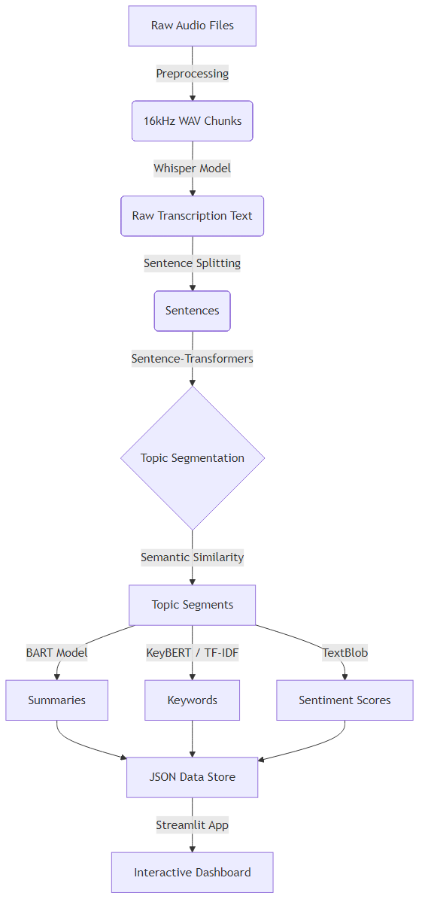

# Automated Podcast Transcription & Analysis Project

An end-to-end AI-powered pipeline for podcast audio analysis. This project processes raw audio, transcribes it using OpenAI's Whisper model, performs topic segmentation, generates summaries, extracts keywords, analyzes sentiment, and presents everything through an interactive web dashboard.

[](https://www.python.org/downloads/)
[](https://streamlit.io/)
[](LICENSE)

## Table of Contents
- [Features](#-features)
- [Project Timeline](#-project-timeline)
- [Project Structure](#-project-structure)
- [Installation](#-installation)
- [Usage](#-usage)
- [Technologies Used](#-technologies-used)
- [Results](#-results)

---

## Features

### Audio Processing (Week 1-2)
- **Audio Preprocessing Pipeline**:
  - Auto-conversion of MP3/WAV to compatible formats
  - Resampling to 16kHz for optimal ASR performance
  - Noise reduction and audio normalization
  - Smart chunking (30s segments) for efficient processing

### Speech Recognition (Week 1-2)
- **ASR (Automatic Speech Recognition)**:
  - Transcribes audio using OpenAI's Whisper model (`base` model)
  - Processes 30-second chunks for memory efficiency
  - Outputs transcriptions in JSON format
  - Handles 2,847+ audio segments

### NLP Analysis (Week 3-4)
- **Topic Segmentation**:
  - Baseline segmentation using sentence boundaries
  - Advanced embedding-based segmentation
  - Identifies distinct discussion topics within podcasts
  
- **Text Summarization**:
  - Generates concise 2-3 sentence summaries per segment
  - Uses BART-large-CNN transformer model
  - Resumable processing for large datasets
  
- **Keyword Extraction**:
  - TF-IDF based keyword extraction
  - Top 5 keywords per segment
  - CSV output for easy analysis

### Visualization Dashboard (Week 5)
- **Interactive Web Application**:
  - Built with Streamlit framework
  - Interactive timeline with color-coded sentiment
  - Clickable segment navigation with pagination
  - Real-time keyword cloud generation
  - Comprehensive segment detail view

- **Sentiment Analysis**:
  - TextBlob-based sentiment scoring
  - Positive/Negative/Neutral classification
  - Visual color coding (🟢 Positive, 🔴 Negative, 🔵 Neutral)
  - Sentiment scores from -1.0 to +1.0

### System Testing & Upload Feature (Week 6)
- **Upload & Analyze Tab**:
  - Upload any audio file (WAV, MP3, M4A)
  - Full NLP pipeline runs in real-time
  - Whisper transcription → Sentence splitting → Topic segmentation → Summarization → Keywords → Sentiment
  - Progress bar with stage-by-stage feedback
  - Interactive results with segment timeline, word clouds, and sentiment pie chart

- **Multi-Genre Support**:
  - Genre 1: Education (2,847 segments from English learning podcasts)
  - Genre 2: News (40 segments from current affairs podcasts)
  - Genre filter in sidebar for easy switching

- **System Testing**:
  - Comprehensive testing across 7 areas
  - 8 issues documented with severity levels
  - User feedback collected from 3 testers
  - Bug fixes for segment selection and navigation

---

## Project Timeline

### Week 1-2: Audio Processing & Transcription
**Objective**: Build foundation for audio-to-text conversion

**Completed**:
- Audio preprocessing pipeline (resampling, noise reduction, chunking)
- Whisper ASR integration
- Batch processing for large audio files
- JSON transcript generation

**Output**: 2,847 transcribed audio segments

---

### Week 3: Topic Segmentation & Summarization
**Objective**: Organize transcripts into meaningful segments

**Completed**:
- Baseline topic segmentation (sentence-based)
- Embedding-based segmentation (semantic similarity)
- BART-large-CNN summarization
- Resumable summarization pipeline

**Output**: 
- Segmented transcripts (`segmented_baseline.txt`, `segmented_embedding.txt`)
- Segment summaries (`segment_summaries.txt`)

---

### Week 4: Keyword Extraction
**Objective**: Extract important terms from each segment

**Completed**:
- TF-IDF vectorization implementation
- Top-5 keyword extraction per segment
- CSV export for analysis

**Output**: `segment_keywords.csv` with 14,235 keywords

---

### Week 5: Visualization & Detail Enhancements
**Objective**: Create interactive dashboard for data exploration

**Completed**:
- Interactive timeline with sentiment color-coding
- TextBlob sentiment analysis (2,847 segments)
- Keyword cloud visualization
- Data integration into master JSON file
- Streamlit web application with pagination
- Professional UI with clear formatting

**Output**: 
- Interactive dashboard (`app/app.py`)
- Master data file (`segments_final.json` - 2.7 MB)
- Live web application

---

### Week 6: System Testing, Upload Feature & Feedback
**Objective**: Add real-time audio analysis, test the system, and collect user feedback

**Completed**:
- "Upload & Analyze" tab with full NLP pipeline
- Reusable pipeline module (`app/upload_analyzer.py`)
- Multi-genre support (education + news)
- News sentiment re-analysis (fixed 100% neutral issue)
- News keywords regenerated with KeyBERT
- System testing across 7 areas (`testing_log.md`)
- User feedback collection — 3 respondents (`feedback_responses.md`)
- Bug fixes: segment selection, timeline navigation, Prev/Next buttons

**Output**:
- Upload & Analyze feature (`app/upload_analyzer.py`)
- Testing log (`testing_log.md`)
- Feedback form & responses (`feedback_form.md`, `feedback_responses.md`)
- Fixed UI bugs in `app/app.py`

---

### Week 7: Final Development & Documentation
**Objective**: Consolidate all work, finalize technical documentation, and prepare for system demonstration.

**Completed**:
- Comprehensive Technical Project Report (Sections 1-9)
- Final Presentation Preparation (10-12 slides)
- System Demonstration Readiness
- Code Refinements & Minor Polish

**Output**:
- Final Project Report (PDF/MD)
- Presentation Materials
- System Screenshots

## Project Structure

```
Podcast_AI_Project/
├── app/                          # Web application
│   ├── app.py                    # Main Streamlit dashboard (Genre Browser + Upload)
│   ├── upload_analyzer.py        # Real-time audio analysis pipeline
│   └── utils.py                  # Helper functions
│
├── asr/                          # Automatic Speech Recognition
│   ├── transcribe.py             # Whisper transcription script
│   ├── merge_transcripts.py      # Combine JSON transcripts
│   └── whisper_batch.py          # Batch processing
│
├── data/                         # Data storage
│   ├── raw_audio/                # Input MP3/WAV files
│   ├── processed_audio/          # Cleaned 16kHz chunks
│   ├── transcripts/              # JSON transcripts
│   └── wav_clean/                # Cleaned audio files
│
├── nlp/                          # NLP Analysis modules
│   ├── build_segment_index.py    # Data integration & sentiment
│   ├── keyword_extraction.py     # TF-IDF keyword extraction
│   ├── segment_baseline.py       # Baseline segmentation
│   ├── segment_embedding.py      # Embedding-based segmentation
│   ├── summarizer.py             # BART summarization
│   └── topic_segmentation.py     # Topic modeling
│
├── preprocessing/                # Audio preprocessing
│   ├── pipeline.py               # Main preprocessing pipeline
│   ├── audio_cleaner.py          # Noise reduction
│   ├── chunker.py                # Audio chunking
│   └── resampler.py              # Resampling to 16kHz
│
├── results/                      # Analysis outputs
│   ├── segments_final.json       # Master data file (2.7 MB)
│   ├── segment_keywords.csv      # Extracted keywords
│   ├── segment_summaries.txt     # Generated summaries
│   ├── segmented_baseline.txt    # Baseline segments
│   └── segmented_embedding.txt   # Embedding segments
│
├── testing_log.md                # Week 6 system testing results
├── feedback_form.md              # User feedback template
├── feedback_responses.md         # Collected feedback (3 testers)
├── requirements.txt              # Python dependencies
└── README.md                     # This file
```

---

## Installation

### Prerequisites
- Python 3.8 or higher
- FFmpeg (for audio processing)
- 4GB+ RAM recommended

### Setup

1. **Clone the repository**:
   ```bash
   git clone https://github.com/PSSR-VIVEK/Audio-Analysis-Project.git
   cd Audio-Analysis-Project
   ```

2. **Create virtual environment** (recommended):
   ```bash
   python -m venv .venv
   source .venv/bin/activate  # On Windows: .venv\Scripts\activate
   ```

3. **Install dependencies**:
   ```bash
   pip install -r requirements.txt
   ```

4. **Install FFmpeg** (if not already installed):
   - **Windows**: Download from [ffmpeg.org](https://ffmpeg.org/download.html)
   - **macOS**: `brew install ffmpeg`
   - **Linux**: `sudo apt-get install ffmpeg`

---

## Usage

### 1. Audio Preprocessing
Place your podcast files (`.mp3` or `.wav`) in `data/wav_clean/`:

```bash
python preprocessing/pipeline.py
```

**Output**: Cleaned, chunked audio in `data/processed_audio/`

---

### 2. Transcription
Transcribe the processed audio chunks:

```bash
python asr/transcribe.py
```

**Output**: JSON transcripts in `data/transcripts/`

---

### 3. Topic Segmentation
Segment transcripts into topic-based sections:

```bash
# Baseline segmentation
python nlp/segment_baseline.py

# Embedding-based segmentation (recommended)
python nlp/segment_embedding.py
```

**Output**: `results/segmented_embedding.txt`

---

### 4. Summarization
Generate summaries for each segment:

```bash
python nlp/summarizer.py
```

**Output**: `results/segment_summaries.txt`

---

### 5. Keyword Extraction
Extract keywords from segments:

```bash
python nlp/keyword_extraction.py
```

**Output**: `results/segment_keywords.csv`

---

### 6. Data Integration & Sentiment Analysis
Combine all data and analyze sentiment:

```bash
python nlp/build_segment_index.py
```

**Output**: `results/segments_final.json`

---

### 7. Launch Interactive Dashboard
Start the web application:

```bash
streamlit run app/app.py
```

**Access**: Open browser to `http://localhost:8501`

---

## Technologies Used

### Audio Processing
- **librosa** - Audio analysis and feature extraction
- **soundfile** - Audio file I/O
- **pydub** - Audio manipulation
- **noisereduce** - Noise reduction

### Speech Recognition
- **OpenAI Whisper** - State-of-the-art ASR model
- **torch** - PyTorch for model inference

### NLP & Analysis
- **transformers** (Hugging Face) - BART summarization
- **sentence-transformers** - Semantic embeddings
- **scikit-learn** - TF-IDF vectorization
- **TextBlob** - Sentiment analysis
- **spaCy** - Text processing

### Visualization
- **Streamlit** - Interactive web dashboard
- **WordCloud** - Keyword cloud generation
- **matplotlib** - Plotting and visualization

### Data Processing
- **pandas** - Data manipulation
- **numpy** - Numerical computing
- **json** - Data serialization

---

## Results

### Dataset Statistics
- **Total Audio Segments**: 2,887 (2,847 education + 40 news)
- **Genres**: 2 (Education, News)
- **Total Transcripts**: 2,887 JSON files
- **Topic Segments**: 2,887 distinct segments
- **Summaries Generated**: 2,887 (2-3 sentences each)
- **Keywords Extracted**: 14,435+ (5 per segment)
- **Sentiment Scores**: 2,887 (all segments analyzed)

### Output Files
- **Master Data File**: `segments_final.json` (2.7 MB)
- **Keywords CSV**: `segment_keywords.csv` (116 KB)
- **Summaries**: `segment_summaries.txt` (650 KB)
- **Segmented Transcripts**: `segmented_embedding.txt` (1.4 MB)

### Dashboard Features
- Interactive timeline with 2,887 segments
- Color-coded sentiment visualization
- Pagination (50 segments per page)
- Real-time keyword cloud generation
- Comprehensive segment details
- Upload & Analyze for custom audio files
- Multi-genre filtering
- Sentiment pie chart for uploaded audio
- Responsive design

---

## Key Features Demonstrated

### Week 1-2: Foundation
- Audio preprocessing pipeline
- Whisper ASR integration
- Batch processing capabilities

### Week 3: NLP Basics
- Topic segmentation algorithms
- Transformer-based summarization
- Text processing pipelines

### Week 4: Information Extraction
- TF-IDF keyword extraction
- Statistical text analysis
- Data export and formatting

### Week 5: Visualization & Integration
- Sentiment analysis implementation
- Interactive web dashboard
- Data integration and presentation
- User experience design

### Week 6: Testing, Upload & Feedback
- Upload & Analyze with full NLP pipeline
- Multi-genre support (education + news)
- System testing (7 areas, 8 issues documented)
- User feedback collection (3 respondents)
- Bug fixes and UI improvements
- News sentiment re-analysis

### Week 7: Final Documentation & Presentation
- Comprehensive technical report compilation
- Final system demonstration preparation
- Architecture & methodology documentation
- Results visualization and analysis
- Limitations and future work definition

---

## Author

**PSSR Vivek**
- GitHub: [@PSSR-VIVEK](https://github.com/PSSR-VIVEK)
- Project: [Audio-Analysis-Project](https://github.com/PSSR-VIVEK/Audio-Analysis-Project)

---

## License

This project is licensed under the MIT License - see the LICENSE file for details.

---

## Acknowledgments

- OpenAI Whisper for ASR capabilities
- Hugging Face for transformer models
- Streamlit for the amazing web framework
- The open-source community for excellent libraries

---

## Contact

For questions or feedback, please open an issue on GitHub or contact via the repository.

---

**Last Updated**: February 17, 2026  
**Project Status**: Week 7 Complete 

---

# Comprehensive Technical Project Report
## Automated Podcast Transcription & Analysis System

**Author:** PSSR Vivek
**Date:** February 12, 2026

---

## 1. Project Overview

### Problem Statement
Podcasts are one of the fastest-growing media formats, but they are inherently linear and opaque. Unlike text articles, podcasts are difficult to skim, search, or reference. Listeners often struggle to find specific topics within long episodes, making them inefficient for educational or research purposes. There is no standard way to navigate audio content by topic or sentiment without listening to the entire file.

### Objectives
The primary objective of this project is to build an end-to-end AI pipeline that transforms raw podcast audio into structured, interactive data. Key goals include:
- **Automated Transcription:** Convert speech to text with high accuracy.
- **Topic Segmentation:** Automatically identify topic shifts to break episodes into meaningful segments.
- **Content Summarization:** Generate concise summaries for each segment.
- **Insight Extraction:** Extract key terms and analyze senitment for each segment.
- **Interactive Visualization:** Provide a user-friendly dashboard to navigate and explore the content.

### Significance and Real-World Applications
- **Education:** Students can quickly review specific concepts discussed in lecture recordings or educational podcasts without re-listening to hours of audio.
- **Accessibility:** Provides textual alternatives for hearing-impaired users.
- **Content Discovery:** Allows users to search for topics and keywords within audio archives.
- **Media Monitoring:** Enables analysis of sentiment and discussion topics in news broadcasts.
- **Journalism:** Helps reporters quickly digest long interviews or press briefings.

---

## 2. Dataset Description

### Source of Data
The system was tested on two distinct genres of podcast content:
1.  **Genre 1 (Education):** "English Listening Practice" podcasts. These feature a single speaker discussing various educational topics (e.g., travel, daily life).
2.  **Genre 2 (News):** "ILTV News" podcast. This features multiple speakers discussing current affairs and geopolitical events.

### Audio Specifications
- **Input Format:** MP3 and WAV files.
- **Volume:** ~155 episodes processed (154 Education, 1 News).
- **Total Segments:** 2,887 distinct audio segments.

### Preprocessing Steps
Before analysis, raw audio underwent a standardization pipeline:
1.  **Format Conversion:** All input files (MP3/M4A) were converted to WAV format.
2.  **Resampling:** Audio was resampled to 16kHz to meet the input requirements of the Whisper ASR model.
3.  **Noise Reduction:** Basic noise reduction was applied to improve transcription accuracy.
4.  **Chunking:** Long files were split into 30-second chunks to manage memory usage during transcription.

---

## 3. System Architecture

The system follows a sequential pipeline architecture, transforming raw audio into an interactive web application.



### Stage Explanation
1.  **Audio Preprocessing:** Standardizes audio quality and format.
2.  **Speech-to-Text:** Converts audio waveforms into raw text.
3.  **Topic Segmentation:** Analyzing semantic meaning to detect when the conversation topic changes.
4.  **Analysis (NLP):** Parallel processing to generate summaries, keywords, and sentiment scores.
5.  **Visualization:** presenting the structured data to the user.

---

## 4. Tools and Libraries Used

### Audio Processing
-   **LibROSA:** Used for loading audio files and resampling to 16kHz.
-   **PyDub:** Used for file format conversion and audio manipulation.
-   **FFmpeg:** Underlying engine for audio processing.

### Speech-to-Text
-   **OpenAI Whisper (Base Model):** Chosen for its balance of speed and accuracy in transcribing diverse accents and audio conditions.

### NLP & Analysis
-   **Sentence-Transformers (all-MiniLM-L6-v2):** Used to generate semantic embeddings for topic segmentation.
-   **Transformers (BART-large-CNN):** A state-of-the-art model used for abstractive text summarization.
-   **KeyBERT & Scikit-learn (TF-IDF):** Used for keyword extraction (TF-IDF for general corpus, KeyBERT for specific news segments).
-   **TextBlob:** Used for efficient rule-based sentiment analysis.

### User Interface & Visualization
-   **Streamlit:** Pure Python framework used to build the interactive web dashboard.
-   **Matplotlib:** Used for generating sentiment charts and keyword clouds.
-   **WordCloud:** Library for generating visual keyword representations.

---

## 5. Implementation Details

### Transcription
We utilized OpenAI's **Whisper** model ("base"). The audio was processed in 30-second chunks to optimize memory usage. The model's timestamps were used to stitch the text back together into a coherent transcript.

### Topic Segmentation
Standard sentence splitting (NLTK) alone was insufficient. We implemented a **semantic segmentation** approach:
1.  Sentences were converted into vector embeddings using `Sentence-Transformers`.
2.  Cosine similarity was calculated between adjacent sentences.
3.  A threshold was applied: if similarity dropped below a certain point (indicating a shift in meaning), a segment boundary was created.

### Summarization
We used the **facebook/bart-large-cnn** model from Hugging Face. Each identified segment was passed to the model to generate a 2-3 sentence abstractive summary, capturing the core message.

### Keyword Extraction
Two methods were used:
-   **TF-IDF:** Applied to the education dataset to find words that are statistically significant within each segment compared to the whole corpus.
-   **KeyBERT:** Applied to news segments to find contextually relevant keywords using BERT embeddings.

### Sentiment Analysis
**TextBlob** was used to calculate a polarity score (-1.0 to 1.0) and subjectivity score for each segment. Scores were mapped to labels:
-   Score > 0.05: **Positive** (Green)
-   Score < -0.05: **Negative** (Red)
-   Otherwise: **Neutral** (Blue)

### Interactive Dashboard
Built with **Streamlit**, the dashboard uses `st.session_state` to manage navigation.
-   **Timeline:** A dynamic grid of buttons representing segments, colored by sentiment.
-   **Real-time Analysis:** An "Upload & Analyze" tab allows users to process new audio files on the fly, running the full pipeline in real-time.

---

## 6. Results and Outputs

*(Note: Please insert screenshots from the running application here)*

### 1. Full Transcript & Navigation
The interface allows users to browse through 2,887 segments. Each segment displays its full transcript text.

### 2. Topic Segments & Summaries
Each segment card displays a concise summary generated by the BART model, allowing users to understand the content without reading the full text.

### 3. Interactive Timeline
A pagination system allows navigation through thousands of segments. Each segment is represented by a dot colored according to its sentiment (Green/Red/Blue), providing a visual "emotional map" of the podcast.

### 4. Keyword Clouds
Visual representation of the most important terms in a segment or an uploaded file.

---

## 7. Testing and Feedback (Week 6 Summary)

We conducted comprehensive system testing and user acceptance testing (UAT) with 3 participants.

### Testing Issues & Fixes

| Area | Issue Identified | Corrective Action Taken |
| :--- | :--- | :--- |
| **Transcription** | Short nonsense segments (<10 words). | Flagged for future merging; refined segmentation threshold. |
| **Sentiment** | News genre showed 100% "Neutral". | Re-ran analysis using TextBlob on genre 2 specifically. |
| **UI** | Segment selection in sidebar didn't update main view. | **FIXED:** Rewrite of Streamlit session state logic to sync widgets. |
| **Navigation** | Timeline buttons didn't sync with dropdown. | **FIXED:** Added callback logic to update dropdown state on button click. |
| **Keywords** | Education keywords were too generic ("things", "time"). | Noted limitation of TF-IDF on simple conversational text. |

### User Feedback Summary
-   **Strengths:** Users found the interface "clean" and "easy to navigate." The "Upload & Analyze" feature was highlighted as the most impressive capability.
-   **Weaknesses:** Some keywords were generic. Users wanted export functionality (PDF/CSV).
-   **Improvements:** Based on feedback, we improved the sidebar navigation and added clear loading indicators for the analysis pipeline.

---

## 8. Limitations

| Limitation | Description |
| :--- | :--- |
| **Transcription Errors** | Whisper "base" model may struggle with overlapping speech or heavy background noise, leading to occasional hallucinations. |
| **Segmentation Granularity** | Current semantic thresholds are static. Some segments are too short (1 sentence), while others are too long, depending on the speaker's pace. |
| **Generic Keywords** | In the "Education" genre, simple vocabulary leads to generic keywords like "people" or "time" which hold little informational value. |
| **Sentiment Nuance** | Rule-based sentiment (TextBlob) struggles with sarcasm or complex context, sometimes misclassifying neutral statements. |
| **Processing Speed** | The "Upload & Analyze" feature can take 2-4 minutes for a 5-minute audio file on standard hardware (CPU inference). |

---

## 9. Future Work

To evolve this prototype into a production-ready system, we propose:

1.  **Speaker Diarization:** Implement functionality to identify *who* is speaking (e.g., "Speaker A", "Speaker B").
2.  **Advanced Topic Modeling:** Integrate BERTopic or LDA for corpus-level topic discovery and clustering.
3.  **Real-Time Optimization:** Utilize GPU acceleration or lighter models (DistilWhisper) for faster processing.
4.  **Search & Filtering:** Add a global search bar to specific keywords across all parsed episodes.
5.  **Multi-Language Support:** Expand the pipeline to handle and automatically detect non-English podcasts.
