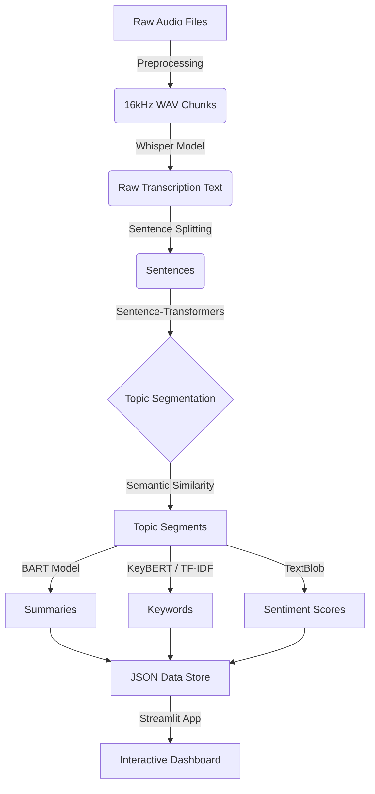

# Comprehensive Technical Project Report
## Automated Podcast Transcription & Analysis System

**Author:** PSSR Vivek
**Date:** February 12, 2026

---

## 1. Project Overview

### Problem Statement
Podcasts are one of the fastest-growing media formats, but they are inherently linear and opaque. Unlike text articles, podcasts are difficult to skim, search, or reference. Listeners often struggle to find specific topics within long episodes, making them inefficient for educational or research purposes. There is no standard way to navigate audio content by topic or sentiment without listening to the entire file.

### Objectives
The primary objective of this project is to build an end-to-end AI pipeline that transforms raw podcast audio into structured, interactive data. Key goals include:
- **Automated Transcription:** Convert speech to text with high accuracy.
- **Topic Segmentation:** Automatically identify topic shifts to break episodes into meaningful segments.
- **Content Summarization:** Generate concise summaries for each segment.
- **Insight Extraction:** Extract key terms and analyze senitment for each segment.
- **Interactive Visualization:** Provide a user-friendly dashboard to navigate and explore the content.

### Significance and Real-World Applications
- **Education:** Students can quickly review specific concepts discussed in lecture recordings or educational podcasts without re-listening to hours of audio.
- **Accessibility:** Provides textual alternatives for hearing-impaired users.
- **Content Discovery:** Allows users to search for topics and keywords within audio archives.
- **Media Monitoring:** Enables analysis of sentiment and discussion topics in news broadcasts.

---

## 2. Dataset Description

### Source of Data
The system was tested on two distinct genres of podcast content:
1.  **Genre 1 (Education):** "English Listening Practice" podcasts. These feature a single speaker discussing various educational topics (e.g., travel, daily life).
2.  **Genre 2 (News):** "ILTV News" podcast. This features multiple speakers discussing current affairs and geopolitical events.

### Audio Specifications
- **Input Format:** MP3 and WAV files.
- **Volume:** ~155 episodes processed (154 Education, 1 News).
- **Total Segments:** 2,887 distinct audio segments.

### Preprocessing Steps
Before analysis, raw audio underwent a standardization pipeline:
1.  **Format Conversion:** All input files (MP3/M4A) were converted to WAV format.
2.  **Resampling:** Audio was resampled to 16kHz to meet the input requirements of the Whisper ASR model.
3.  **Noise Reduction:** Basic noise reduction was applied to improve transcription accuracy.
4.  **Chunking:** Long files were split into 30-second chunks to manage memory usage during transcription.

---

## 3. System Architecture

The system follows a sequential pipeline architecture, transforming raw audio into an interactive web application.

### Stage Explanation
1.  **Audio Preprocessing:** Standardizes audio quality and format.
2.  **Speech-to-Text:** Converts audio waveforms into raw text.
3.  **Topic Segmentation:** Analyzing semantic meaning to detect when the conversation topic changes.
4.  **Analysis (NLP):** Parallel processing to generate summaries, keywords, and sentiment scores.
5.  **Visualization:** presenting the structured data to the user.

---

## 4. Tools and Libraries Used

### Audio Processing
-   **LibROSA:** Used for loading audio files and resampling to 16kHz.
-   **PyDub:** Used for file format conversion and audio manipulation.
-   **FFmpeg:** Underlying engine for audio processing.

### Speech-to-Text
-   **OpenAI Whisper (Base Model):** Chosen for its balance of speed and accuracy in transcribing diverse accents and audio conditions.

### NLP & Analysis
-   **Sentence-Transformers (all-MiniLM-L6-v2):** Used to generate semantic embeddings for topic segmentation.
-   **Transformers (BART-large-CNN):** A state-of-the-art model used for abstractive text summarization.
-   **KeyBERT & Scikit-learn (TF-IDF):** Used for keyword extraction (TF-IDF for general corpus, KeyBERT for specific news segments).
-   **TextBlob:** Used for efficient rule-based sentiment analysis.

### User Interface & Visualization
-   **Streamlit:** Pure Python framework used to build the interactive web dashboard.
-   **Matplotlib:** Used for generating sentiment charts and keyword clouds.
-   **WordCloud:** Library for generating visual keyword representations.

---

## 5. Implementation Details

### Transcription
We utilized OpenAI's **Whisper** model ("base"). The audio was processed in 30-second chunks to optimize memory usage. The model's timestamps were used to stitch the text back together into a coherent transcript.

### Topic Segmentation
Standard sentence splitting (NLTK) alone was insufficient. We implemented a **semantic segmentation** approach:
1.  Sentences were converted into vector embeddings using `Sentence-Transformers`.
2.  Cosine similarity was calculated between adjacent sentences.
3.  A threshold was applied: if similarity dropped below a certain point (indicating a shift in meaning), a segment boundary was created.

### Summarization
We used the **facebook/bart-large-cnn** model from Hugging Face. Each identified segment was passed to the model to generate a 2-3 sentence abstractive summary, capturing the core message.

### Keyword Extraction
Two methods were used:
-   **TF-IDF:** Applied to the education dataset to find words that are statistically significant within each segment compared to the whole corpus.
-   **KeyBERT:** Applied to news segments to find contextually relevant keywords using BERT embeddings.

### Sentiment Analysis
**TextBlob** was used to calculate a polarity score (-1.0 to 1.0) and subjectivity score for each segment. Scores were mapped to labels:
-   Score > 0.05: **Positive** (Green)
-   Score < -0.05: **Negative** (Red)
-   Otherwise: **Neutral** (Blue)

### Interactive Dashboard
Built with **Streamlit**, the dashboard uses `st.session_state` to manage navigation.
-   **Timeline:** A dynamic grid of buttons representing segments, colored by sentiment.
-   **Real-time Analysis:** An "Upload & Analyze" tab allows users to process new audio files on the fly, running the full pipeline in real-time.

---

## 6. Results and Outputs

*(Note: Please insert screenshots from the running application here)*

### 1. Full Transcript & Navigation
The interface allows users to browse through 2,887 segments. Each segment displays its full transcript text.

### 2. Topic Segments & Summaries
Each segment card displays a concise summary generated by the BART model, allowing users to understand the content without reading the full text.

### 3. Interactive Timeline
A pagination system allows navigation through thousands of segments. Each segment is represented by a dot colored according to its sentiment (Green/Red/Blue), providing a visual "emotional map" of the podcast.

### 4. Keyword Clouds
Visual representation of the most important terms in a segment or an uploaded file.

---

## 7. Testing and Feedback (Week 6 Summary)

We conducted comprehensive system testing and user acceptance testing (UAT) with 3 participants.

### Testing Issues & Fixes

| Area | Issue Identified | Corrective Action Taken |
| :--- | :--- | :--- |
| **Transcription** | Short nonsense segments (<10 words). | Flagged for future merging; refined segmentation threshold. |
| **Sentiment** | News genre showed 100% "Neutral". | Re-ran analysis using TextBlob on genre 2 specifically. |
| **UI** | Segment selection in sidebar didn't update main view. | **FIXED:** Rewrite of Streamlit session state logic to sync widgets. |
| **Navigation** | Timeline buttons didn't sync with dropdown. | **FIXED:** Added callback logic to update dropdown state on button click. |
| **Keywords** | Education keywords were too generic ("things", "time"). | Noted limitation of TF-IDF on simple conversational text. |

### User Feedback Summary
-   **Strengths:** Users found the interface "clean" and "easy to navigate." The "Upload & Analyze" feature was highlighted as the most impressive capability.
-   **Weaknesses:** Some keywords were generic. Users wanted export functionality (PDF/CSV).
-   **Improvements:** Based on feedback, we improved the sidebar navigation and added clear loading indicators for the analysis pipeline.

---

## 8. Limitations

| Limitation | Description |
| :--- | :--- |
| **Transcription Errors** | Whisper "base" model may struggle with overlapping speech or heavy background noise, leading to occasional hallucinations. |
| **Segmentation Granularity** | Current semantic thresholds are static. Some segments are too short (1 sentence), while others are too long, depending on the speaker's pace. |
| **Generic Keywords** | In the "Education" genre, simple vocabulary leads to generic keywords like "people" or "time" which hold little informational value. |
| **Sentiment Nuance** | Rule-based sentiment (TextBlob) struggles with sarcasm or complex context, sometimes misclassifying neutral statements. |
| **Processing Speed** | The "Upload & Analyze" feature can take 2-4 minutes for a 5-minute audio file on standard hardware (CPU inference). |

---

## 9. Future Work

To evolve this prototype into a production-ready system, we propose:

1.  **Speaker Diarization:** Implement functionality to identify *who* is speaking (e.g., "Speaker A", "Speaker B").
2.  **Advanced Topic Modeling:** Integrate BERTopic or LDA for corpus-level topic discovery and clustering.
3.  **Real-Time Optimization:** Utilize GPU acceleration or lighter models (DistilWhisper) for faster processing.
4.  **Search & Filtering:** Add a global search bar to specific keywords across all parsed episodes.
5.  **Multi-Language Support:** Expand the pipeline to handle and automatically detect non-English podcasts.
