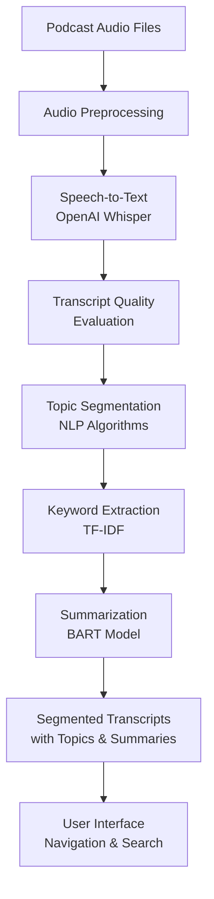

# 🎧 Automated Podcast Transcription and Topic Segmentation

> *AI-powered system for transcribing long-form podcast audio and automatically segmenting it into topical sections*

## 📋 Project Overview

The goal of this project is to develop an **AI-powered system** that automatically transcribes podcast audio recordings and segments them into distinct topical sections.

Leveraging advances in **speech-to-text technology (ASR)** and **natural language processing (NLP)**, the system enables users to navigate podcasts efficiently by browsing topics, key discussion points, and compact summaries without listening to the entire episode.

### 🎯 Key Outcomes

- 🎙️ Understand speech recognition techniques for converting audio to text
- 🧠 Implement NLP methods to identify topic changes and segment transcripts
- 🔄 Build an end-to-end pipeline: audio ingestion → preprocessing → transcription → segmentation → indexing
- 📊 Visualize segment boundaries, extract keywords, and generate compact summaries for each topic
- 📝 Prepare comprehensive documentation and final presentation describing methodology, challenges, and user benefits

### 🏗️ Model Architecture


## 📊 Dataset

**Chosen Dataset:**

**This American Life Podcast Transcript Dataset** (Kaggle)

- 🔗 Link: https://www.kaggle.com/datasets/thedevastator/this-american-life-podcast-transcript-dataset
- 📈 ~600+ episodes
- ✨ High-quality aligned transcripts with timestamps and speaker information
- 🎵 **Matching audio files** legally downloaded from the official archive: https://www.thisamericanlife.org/archive
- 🎯 **Current working subset:** 200 episodes (transcripts + downloaded MP3 audio)

## 📅 Project Milestones & Timeline (6 Weeks - Completed)

| Milestone | Weeks | Notebooks Folder | Main Deliverables | Status |
|-----------|-------|------------------|-------------------|--------|
| 1 | 1–2 | `milestone_1/` | Dataset acquisition, exploration, audio preprocessing | ✅ Complete |
| 2 | 3–4 | `milestone_2/` | Initial transcription (Whisper), topic segmentation algorithms | ✅ Complete |
| 3 | 5–6 | `milestone_3/` | Keyword extraction, summarization, visualizations, system testing & feedback | ✅ Complete |

## 🛠️ Technologies Used

- **💻 Environment**: Python 3.8+ (VS Code + local development)
- **🎵 Audio Processing**: librosa, pydub, soundfile, pyloudnorm, noisereduce
- **🎙️ Speech-to-Text**: OpenAI Whisper (tiny/base models)
- **🧠 NLP & Segmentation**: nltk, sentence-transformers, scikit-learn, transformers
- **📊 Evaluation**: jiwer (Word Error Rate)
- **📈 Visualization**: matplotlib, plotly (planned)
- **🌐 UI Framework**: Streamlit (web interface for podcast navigation)

## 🚀 Setup Instructions

1. **📥 Clone Repository** (if applicable) or ensure you have the project files

2. **🐍 Create Python Environment**:
   ```bash
   python -m venv audio_project_env
   # Activate: audio_project_env\Scripts\activate (Windows) or source audio_project_env/bin/activate (Linux/Mac)
   

3. **📦 Install Dependencies**:
   ```bash
   pip install -r requirements.txt
   

4. **⚡ GPU Setup** (optional, recommended for faster Whisper processing):
   - Install CUDA 11.8+ if you have an NVIDIA GPU
   - PyTorch will automatically detect and use GPU acceleration

5. **✅ Verify Installation**:
   ```python
   import whisper
   import librosa
   print("Setup complete!")
   

6. **📁 File Organization**:
   - Raw audio: `data/audio_raw/
   - Processed audio: `data/audio_processed/
   - Transcripts: `data/transcripts_processed/
   - Notebooks: `notebooks/` directory
7. **Run the Web App** (after completing all weeks):
   ```bash
   streamlit run data/app/podcast_navigation_app.py
   
## 📂 Project Structure

```
Audio Project/
├── README.md                          # Main project documentation
├── PROJECT_DOCUMENTATION.md           # Detailed week-by-week documentation
├── requirements.txt                   # Python dependencies
│
├── data/                              # Data directory
│   ├── README.md                      # Data folder documentation
│   ├── app/
│   │   ├── podcast_navigation_app.py  # Main Streamlit web application
│   │   └── testing_app.py             # Testing app for Week 6
│   ├── audio_raw/                     # Original podcast MP3 files (200 episodes)
│   ├── audio_processed/               # Preprocessed WAV files (normalized, cleaned)
│   ├── audio_tmp/                     # Temporary audio chunks during processing
│   ├── transcripts_raw/               # Original reference transcripts
│   ├── transcripts_raw_truncated/     # 200-episode subset
│   ├── transcripts_processed/         # Whisper-generated transcriptions with timestamps
│   ├── episode_images/                # Episode artwork and metadata images
│   ├── segmented_outputs/             # Topic-segmented transcripts (JSON format)
│   │   └── episode_*.json             # Individual episode segments
│   ├── segments_processed/            # Processed segment metadata
│   │   └── all_segments.csv           # Aggregated segment data
│   └── test/                          # Week 6 testing data
│       └── segmented_outputs/
│           └── week6_test/            # Test data for 5 new episodes
│
└── notebooks/                         # Jupyter notebooks for analysis & development
    ├── milestone_1/                   # Foundation & Data Acquisition (Weeks 1-2)
    │   ├── week_1/
    │   │   ├── project_init_and_dataset_acquisition.ipynb
    │   │   └── README.md
    │   └── week_2/
    │       ├── audio_preprocessing_and_speech_to_text.ipynb
    │       ├── transcript_quality_evaluation.ipynb
    │       └── README.md
    │
    ├── milestone_2/                   # Core Pipeline Development (Weeks 3-4)
    │   ├── week_3/
    │   │   ├── topic_segmentation_keyword_extraction_summarization.ipynb
    │   │   └── README.md
    │   └── week_4/
    │       ├── README.md
    │       └── screenshots/
    │           ├── app_theme.png
    │           ├── browse_episodes.png
    │           ├── main_interface.png
    │           └── search_topics.png
    │
    └── milestone_3/                   # Optimization & System Testing (Weeks 5-6)
        ├── week_5/
        │   ├── README.md
        │   └── notebooks/             # Optimization experiments
        └── week_6/
            ├── README.md
            ├── system_testing.ipynb
            └── screenshots/
                ├── dashboard.png
                ├── search_topics.png
                ├── test_episodes1.png
                ├── test_episodes2.png
                └── feedback.png
```


## 📈 Current Status

✅ **Completed:**
- Dataset acquired: 200 episodes (transcripts + audio)
- Environment setup completed (Python environment with GPU support)
- **Week 1**: Project initialization and dataset acquisition
- **Week 2**: Audio preprocessing pipeline and Whisper transcription
- **Week 3**: Topic segmentation, keyword extraction, and summarization
- **Week 4**: Streamlit web application for podcast navigation
- **Week 5**: Advanced processing refinements and pipeline optimization
- **Week 6**: System testing on 5 diverse episodes, structured feedback collection (3–5 testers), practical improvement recommendations


📋 **Key Achievements:**
- ✨ Full audio preprocessing pipeline (noise reduction, normalization, chunking)
- 🎙️ Whisper ASR integration with quality evaluation (WER metrics)
- 🧠 Multi-algorithm topic segmentation (TF-IDF, embeddings, LLM-based)
- 🏷️ Automated keyword extraction and BART summarization
- 💬 Sentiment analysis and topic labeling
- 🌐 Interactive Streamlit web app for podcast topic navigation
- 📊 System testing framework with user feedback collection
- 📚 Comprehensive documentation with visual flowcharts and screenshots


## 📚 References

- Kaggle Dataset: https://www.kaggle.com/datasets/thedevastator/this-american-life-podcast-transcript-dataset
- Audio Source: https://www.thisamericanlife.org (public archive)

---


