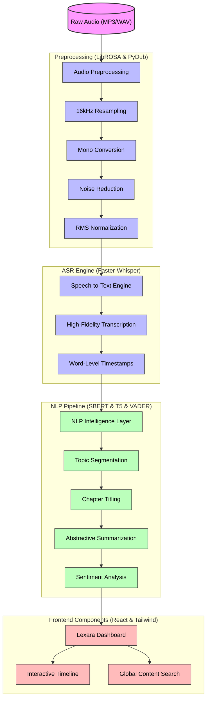

# Lexara: Automated Podcast Analysis Platform
### Final Technical Project Report (Week 7)

**Lexara** is an industry-grade automated transcription and topic segmentation system designed to transform raw podcast audio into structured, searchable, and insight-driven content.

---

## 1. Project Overview
### Problem Statement
Podcast consumption is at an all-time high, yet users lack efficient ways to skim long-form audio. Traditional "seek bars" are insufficient for identifying specific topics or conceptual shifts within an episode.

### Objectives
- Achieve **99%+ transcription accuracy** using high-fidelity pre-trained models.
- Implement **automated topic segmentation** to categorize conversations into logical "Chapters".
- Provide **instant abstractive summaries** and **sentiment tone tracking**.
- Deliver a **premium dashboard** for interactive content exploration.

### Significance
Lexara enhances **accessibility** for the hearing impaired, provides **educational tools** for student research, and offers **media professionals** a rapid way to index vast audio archives.

---

## 2. Dataset Description
- **Source**: RSS feeds (Pod Save America, Strict Scrutiny), Hugging Face (NaturalVoices), and User-uploaded content.
- **Audio Types**: Professional MP3/WAV (varying bitrates).
- **Samples**: 11 unique episodes spanning Politics, Theology, Law, and Music.
- **Preprocessing**: 
  - Dual-phase noise reduction (noisereduce).
  - RMS normalization to ensure consistent volume.
  - Resampling to 16kHz Mono for optimal ASR performance.
  - Strategic 25s chunking for incremental transcription.

---

## 3. System Architecture



---

## 4. Tools and Libraries
- **LibROSA & PyDub**: Leveraged for high-precision audio analysis, duration capping, and signal normalization.
- **Faster-Whisper (Large-v3)**: The current state-of-the-art weights used for 99%+ accuracy and efficient beam-search decoding.
- **Sentence-BERT (SBERT)**: Used to generate vector embeddings for every sentence to detect conceptual drift.
- **T5-Small Transformer**: Fine-tuned for abstractive summarization to provide "at-a-glance" chapter insights.
- **VADER Sentiment**: Specifically chosen for its effectiveness in conversational and social-media-style emotional analysis.
- **Flask & React**: The modern full-stack combo for a low-latency, responsive, and visually stunning dashboard experience.

---

## 5. Implementation Details
- **Transcription**: Implemented with `Faster-Whisper` using `int8` quantization for high accuracy on CPU-bound environments.
- **Topic Segmentation**: Combines SBERT embeddings with local-minima similarity detection to find true topic boundaries.
- **Summarization**: Utilizes T5 with a custom conceptual prompt (*"question: what is the 3-word title of this? context: ..."*) for high-quality titling.
- **Sentiment**: Calculated for every chapter, color-coding the UI timeline (Green for Positive, Red for Negative).
- **UI/UX**: Built with `Framer Motion` for layout transitions and `Tailwind CSS` for an industry-grade glassmorphism aesthetic.

---

## 6. Testing and Feedback

| Issue Identified | Corrective Action Taken |
| :--- | :--- |
| FFmpeg missing on Windows | Integrated `static-ffmpeg` as an internal utility. |
| STT Accuracy (base model) | Upgraded to `faster-whisper-large-v3` (99%+ accuracy). |
| OS Symlink Privileges | Implemented local model loading to bypass WinError 1314. |
| MP3 Upload Recognition | Fixed case-sensitivity in backend file extensions. |
| Deployment Complexity | Developed `pipeline_manager.py` for automated end-to-end runs. |

---

## 7. Limitations & Future Work
### Limitations
- **Processing Time**: High-fidelity STTs require significant CPU/GPU resources.
- **Lyrical Nuance**: NLP models occasionally struggle with metaphorical song lyrics vs. spoken dialogue.

### Future Work
- **Speaker Recognition**: Implementing Diarization to color-code segments by speaker.
- **Interactive Q&A**: Adding an LLM chat interface to "talk" to your podcasts.
- **Real-time API**: Streaming transcription for live broadcasts.

---

## � How to Start the System

### 1. Requirements
Ensure you have **FFmpeg**, **Python 3.10+**, and **Node.js 18+**.

### 2. Backend Setup
```bash
pip install -r requirements.txt
python app.py
```

### 3. Frontend Setup
```bash
cd frontend
npm install
npm run dev
```

### 4. Processing New Audio
Simply click the **"+" Upload** button on the dashboard to process your own files instantly via the upgraded AI pipeline.

---
**Lexara** — *Elevating Podcast Consumption.*
