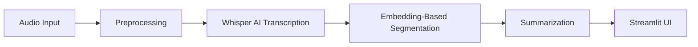

# Automated Podcast Transcription and Topic Segmentation

## 1. Project Overview

This project solves the problem of navigating long audio content. Podcasts often exceed 60 minutes, making it difficult for listeners to find specific topics without listening to the entire episode.

We developed an AI-powered pipeline that automatically transcribes audio, segments it into coherent topics, and provides efficient navigation.

**Key Objectives:**

* **Transcription:** Convert raw audio to accurate text using OpenAI's Whisper model.
* **Segmentation:** Automatically detect topic shifts using semantic embeddings (SentenceTransformers) rather than simple keyword matching.
* **Navigation:** Build a searchable, interactive UI to jump to specific topics immediately.

**Significance and Real-World Applications:**

* **Accessibility:** Provides a bridge for individuals with hearing impairments by offering accurate, timestamped transcripts. Topic segmentation further aids neurodiverse users (e.g., ADHD) by breaking overwhelming audio into manageable, structured chunks.
* **Media & Content:** Allows journalists and content creators to rapidly search through hours of interview footage to find specific quotes or snippets without manual work.

---

## 2. Dataset Description

The system was developed and validated using a diverse collection of **16 podcast episodes**:

* **Long Audio (10 Episodes):** Used for System Testing and validation.
* **9 Episodes** of the *Lex Fridman Podcast* (Deep technical/philosophical conversations, 2–3 hours each).
* **1 Episode** of *BBC Global News* (Rapid topic switching, ~30 mins).


* **Short-Form Dev Set (6 Episodes):**
* **6 Episodes** of *The Habit Coach Podcast* (5–10 mins each). Used during initial development.


**Preprocessing:** All audio files were standardized to **16kHz Mono WAV** format to ensure compatibility with the Whisper model.

**Data Access:**
Due to the large size of the processed audio files, they are not hosted directly on GitHub.

* **Input Audio:** [Google Drive Link](https://drive.google.com/drive/folders/1b-UchpygkaNAT_0Uqpmm6PUAFNTwsnOo)
* **Processed Audio:** [Google Drive Link](https://drive.google.com/drive/folders/1VUw6MQ_yohe9aMr6Lrql8oTQ07a7b-Ti)
* **Audio Chunks:** [Google Drive Link](https://drive.google.com/drive/folders/1o-2Ps9UwJk39pFwEdEtNNszfdX9z6gOJ)
* **Processed Transcripts (JSON):** [Google Drive Link](https://drive.google.com/drive/folders/1AwbyNo-0rXBFFYLJPs0wF2AJkuDZ8P18)
* **Segments Produced (JSON):** [Google Drive Link](https://drive.google.com/drive/folders/1wBGhUjAVtQNNglZnRAX9rDo9spFIWDAv)
* **Model used for summary generation:** [Hugging Face Link](https://huggingface.co/google-t5/t5-small)

---

## 3. System Architecture

The application follows a modular pipeline architecture:



1. **Audio Preprocessing:** Audio standardization, denoising, loudness normalization, silence trimming, and chunking (`audio_preprocessing.py`).
2. **Transcription:** Generating timestamped text (`transcription_generation.py`).
3. **Segmentation:** Semantic similarity analysis (`embedding_segmentation.py`).
4. **Summarization:** Summarization (T5), Keywords (TF-IDF), and Sentiment (VADER).
5. **Visualization:** Interactive Timeline and Keyword Clouds (`app.py`).

---

## 4. Tools and Libraries Used

* **Audio Processing:** `LibROSA` (Loading/Conversion), `Pydub` (Chunking).
* **Speech-to-Text:** `OpenAI Whisper` (Base model).
* **NLP & Segmentation:** `SentenceTransformers` (all-MiniLM-L6-v2) for vectorization; `scikit-learn` for Cosine Similarity.
* **Summarization:** `HuggingFace Transformers` (T5-small).
* **Sentiment Analysis:** `VADER Sentiment` (NLTK) for sentiment scoring.
* **User Interface:** `Streamlit` (Web App), `Altair` (Timeline), `WordCloud`.

---

## 5. Implementation Details

### A. Transcription

We used the **Whisper Base** model. The audio is processed in 10-minute chunks to manage memory usage, with results used back together to form a cohesive JSON transcript containing start/end timestamps for every text segment.

### B. Topic Segmentation (Algorithm Comparison)

We explored multiple methods to identify topic boundaries:

1. **Baseline Approach (TF-IDF):** Attempted to find boundaries based on keyword frequency changes. **Result:** Failed to detect topic shifts when vocabulary changed but context remained similar.
2. **Final Approach (Embeddings):** We implemented a sliding window approach using `all-MiniLM-L6-v2`. We calculated the **Cosine Similarity** between consecutive sentence groups. This method proved significantly better.

**Design Decision: Why Embeddings over LLMs?**
While Generative LLMs (like GPT-4 or Gemini) can perform topic segmentation, we explicitly chose the **Embedding-based approach** for specific engineering reasons:

* **Cost Efficiency:** LLM-based segmentation requires massive token usage, leading to high costs.
* **Latency:** Processing a 3-hour podcast via an LLM is slow. Our embedding approach runs locally on standard hardware (CPU/T4 GPU).

### C. Summarization & Keyword Extraction

* **Summaries:** Generated using `t5-small` to produce a 1-2 sentence abstract for each segment.
* **Keywords:** Extracted using `TF-IDF` scoring to identify unique terms in that specific segment compared to the rest of the document.

---

## 6. Testing and Feedback 

The system was tested against **10 podcast episodes** (varying in length, topic, and speaker style) and feedback was collected from **three external users**.

### Internal System Testing Log

* **Tester:** Self-Testing
* **Scope:** 10 Episodes (~20 hours of audio data)
* **Focus:** Transcription accuracy, segmentation logic, and UI stability.
<!-- 
| Podcast Episode | Type/Genre | Transcription & Segmentation Issues | Summary & Keyword Performance | Sentiment & UI Behavior |
| --- | --- | --- | --- | --- |
| **1. Stephen Wolfram** | Physics (3.5h) | **Segmentation:** Generally good, but some segments are too short (filler words). | **Summary:** Critical Bug. Model entered a repetition loop ("et cetera et cetera" x15). | **Sentiment:** Well-handled. |
| **2. Jed Buchwald** | History (1.5h) | **Transcription:** Entity Error ("Buckwald" vs "Buchwald"). | **Summary:** Recursive phrasing noted in 2 segments. | **Sentiment:** Neutral/Academic tone handled well. |
| **3. Sergey Nazarov** | Crypto (2.5h) | **Segmentation:** "Micro-segments" detected (e.g., segments containing only "Wait, wait"). | **Keywords:** Excellent tech extraction ("DeFi", "Oracle"). | **Sentiment:** Well-handled. |
| **4. Philip Goff** | Philosophy (2h) | **Transcription:** Good handling of abstract terms ("Panpsychism"). | **Keywords:** High relevance ("Consciousness", "Qualia"). | **Sentiment:** "Dark" philosophical concepts occasionally mislabeled as Negative. |
| **5. Oriol Vinyals** | AI/Gaming (1h) | **Segmentation:** Clean boundaries between "StarCraft" and "Language" topics. | **Summary:** Concise and accurate. | **Sentiment:** Well-handled. |
| **6. Ray Dalio** | Economics (1h) | **Transcription:** Clear. | **Keywords:** Noisy. Included numbers ("10") and "Youtube" as top tags. | **Sentiment:** Correctly identified advice as Positive. |
| **7. Michael Malice** | Politics (1.5h) | **Transcription:** Struggled slightly with rapid banter/interruptions. | **Summary:** Context error (interpreted "Dasvidanya" as a name). | **Sentiment:** High variance (Red/Green swings) accurately reflected chaotic tone. |
| **8. Tomaso Poggio** | Neuroscience (1h) | **Segmentation:** Excellent distinct breaks. | **Keywords:** Generic but accurate ("Brains", "Center"). | **Sentiment:** Well-handled. |
| **9. George Hotz** | Tech (3h) | **Transcription:** Good capture of informal slang. | **Summary:** Occasionally vague ("The purpose is to maximize it" - missing context). | **Sentiment:** Mostly Positive/Energetic, matching speaker vibe. |
| **10. Tim Dillon** | Comedy (1.5h) | **Segmentation:** Good. | **Keywords:** Ads mixed with content ("Spoon", "Business"). | **Sentiment:** **Edge Case:** System missed sarcasm, labeling cynical rants as "Positive." | -->

| Podcast Episode | Type/Genre | Transcription & Segmentation Issues | Summary & Keyword Performance | Sentiment & UI Behavior |
| :--- | :--- | :--- | :--- | :--- |
| **1. Lex Fridman Podcast 001: Jed Buchwald** | History of Science | **Transcription:** Phonetic spelling ("Koon" vs "Kuhn", "Buckwald"). | **Summary:** Repetition of "paradigm" in summary. **Keywords:** Phonetic errors included ("Koon"). | **Sentiment:** Argumentative tone ("No, no, no") correctly Negative. |
| **2. Lex Fridman Podcast 002: Sergei Nazarov** | Crypto/Chainlink | **Segmentation:** Excessive micro-segments ("Wait wait", "Oh God"). | **Summary:** Repetition ("pissed off..."). **Keywords:** Conversational noise dominated tags. | **Sentiment:** **Edge Case:** "Pissed off" labeled Positive (0.72) due to "funny" context. |
| **3. Lex Fridman Podcast 008: Tomaso Poggio** | Neuroscience | **Transcription:** Name typo "Tomasopojo". **Segmentation:** Micro-segments detected (<3 words). | **Summary:** Recursive loop ("advisor to many... advisor to many"). | **Sentiment:** "Time travel impossible" labeled Positive (0.96) – debatable classification. |
| **4. Lex Fridman Podcast 011: Peter Norvig** | AI/CS | **Segmentation:** Multiple micro-segments ("the resource constraints from loosens"). | **Summary:** Repetition of years ("2000 2001..."). **Keywords:** Good technical terms ("Sat solvers"), but some fillers. | **Sentiment:** Accurately identifies "no good answers" as Negative. |
| **5. Lex Fridman Podcast 019: Michio Kaku** | Physics | **Transcription:** Hallucination: "I live loosely" (vs "I Love Lucy"). | **Keywords:** **Context Error:** "Kardashian scale" (should be "Kardashev scale"). | **Sentiment:** "Ridiculous" correctly labeled Negative. |
| **6. Lex Fridman Podcast 021: Albert Bourla** | Business (Pfizer) | **Transcription:** Entity error "Berla". **Segmentation:** Extremely short segments ("may help"). | **Summary:** **Critical Bug:** Repetition ("first group will tell you" x3). | **Sentiment:** High variance handled well (Fear/Anger -> Negative). |
| **7. Lex Fridman Podcast 023: Kevin Scott** | Tech (Microsoft) | **Transcription:** "Remember a society" (vs "Member of"). | **Summary:** Captured transcription errors. **Keywords:** High noise ("Like", "Probably", "Stuff"). | **Sentiment:** Self-deprecation ("Embarrassingly") correctly Negative. |
| **8. Lex Fridman Podcast 036: Vijay Kumar** | Robotics | **Transcription:** Entity errors ("Grassblab" vs "GRASP Lab"). | **Summary:** **Critical Loop:** "Most beautiful... most beautiful" (x3). | **Sentiment:** "Drones" as pejorative correctly labeled Negative. |
| **9. Lex Fridman Podcast 039: Yann LeCun** | AI/Deep Learning | **Transcription:** "Yalekun" (Name error). **Disfluency:** Stuttering retained. | **Summary:** Summary captured stutters ("uh, he, uh"). **Keywords:** Hallucinated context ("Iraq"). | **Sentiment:** "Evil" and "Misalignment" correctly Negative. |
| **10. Global News Podcast: Climate Boost** | News (Daily) | **Segmentation:** Ad break included in final segment. | **Summary:** Repetition Loop detected ("fallen back" repeated x2). | **Sentiment:** **Error:** "Emissions fallen" labeled Negative (-0.36), contextually Positive. |

### User Feedback Collection

Feedback was taken from 3 External Users.

#### User 1: Ayush (Friend)

* **Positive:** "The Visual Timeline is the best part. I immediately understood the emotional arc of the episode."
* **Critical Feedback:**
* **The Disconnect:** Attempted to click the bars on the chart to filter data, but nothing happened. Found it frustrating to match Segment IDs manually.
* **Dropdown:** The list is too long to scroll through.


#### User 2: Ishita (Classmate)

* **Positive:** "Cool concept, seeing the shape of a conversation is fascinating."
* **Critical Feedback:**
* **Navigation:** "The dropdown list is very long... scrolling to find a topic feels overwhelming." Suggested "Next/Previous" buttons.
* **Context:** Found it difficult to map the "Sentence Index" numbers to the actual audio progress.


#### User 3: Tanmay (Friend)

* **Positive:** Liked the "Green/Red" sentiment coloring and the clean layout.
* **Critical Feedback:**
* **The "Barcode" Effect:** On long episodes (200+ segments), the chart bars become too thin to hover over effectively.
* **Repetition Bug:** Noticed summary glitches where words repeated ("comrade, comrade") or summaries cut off mid-sentence.
* **Empty Data:** Some segments were just one word (e.g., "Yes", "Sure"), creating clutter.


### Synthesis & Patterns Identified

Based on the combined testing data, the following patterns have emerged that require attention in the iteration phase.

**A. Navigation Friction**

* **Observation:** Users expect the Altair chart to be clickable. When it isn't, they are forced to use the dropdown, which is overwhelming for long episodes (200+ items).
* **Decision:** Implementing full Altair interactivity is complex, but adding "Next Segment" / "Previous Segment" buttons is a low-effort fix to improve flow.

**B. Content Noise (Glitches)**

* **Micro-segments:** Segments with <10 words ("Wait, wait", "Yes") clutter the UI.
* **Summary Loops:** The model occasionally gets stuck repeating phrases ("et cetera").
* **Keywords:** Stop words like "yeah", "oh", and "thing" are appearing in word clouds.

### Implementation of Fixes (Completed)

The following code-level improvements have been successfully implemented in `app.py` to address user feedback.

#### 1: UI & Navigation Improvements

* **Next / Previous Buttons:** Implemented `st.button("Next")` and `st.button("Previous")` to allow users to navigate segments sequentially without repeatedly opening the dropdown list.

#### 2: Data Cleaning & Post-Processing

* **Implemented Micro-Segment Filtering for Navigation:**
* **Issue Identified:** Users found it frustrating to navigate through short, non-substantive segments (e.g., 'Yeah', 'Okay') using the 'Next' button or Dropdown.
* **Corrective Action:** Implemented a filter that excludes segments under 15 words from the navigation controls.
* **Keyword Exclusion:** Updated the `STOP_WORDS` list during display time to explicitly remove common conversational fillers detected during testing:
> `['yeah', 'oh', 'okay', 'right', 'know', 'thing', 'et', 'cetera']`

#### 3: Context Improvement

* **Timestamp Integration:** Replaced the Sentence indices with specific Timestamps (MM:SS).
* **Issue:** Feedback indicated that "Sentence Indices" (e.g., "Sentences 405-420") provided no context regarding the actual position in the audio.

---

## 7. Results and Outputs


1. **DropDown Menu:** Dropdown menu allowing selection of pre-processed podcast episodes or uploading new files.
2. **Interactive Timeline:** Color-coded timeline indicating sentiment flow across the episode.
3. **Segment View:** Clear display of Summary, Transcript, and Keywords for the selected segment.

---

## 8. Limitations

* **Computational Cost:** The pipeline (Whisper + Embeddings + T5) is resource-intensive and requires a GPU for reasonable processing speeds on long files.
* **Speaker Diarization:** The current system does not differentiate between speakers (e.g., Host vs. Guest).
* **Summary Hallucinations:** T5 can occasionally generate generic summaries for very short text blocks.

## 9. Future Work

* **Audio-Timeline Synchronization:** Implementing an interactive feature where clicking a segment on the timeline automatically jumps the audio player to that specific timestamp.
* **Speaker Identification:** Integrating tools like Pyannote.audio to label "Speaker A" and "Speaker B".

---

## 10. Repository Structure

Source files:

* `app.py`: The main **Streamlit User Interface**. Handles upload, preprocessing, transcription, segmentation, and interactive timeline.
* `run_pipeline.py`: **Headless batch processor**. Processes all audio in `audio_input/` without the UI.
* `audio_preprocessing.py`: Audio standardization, denoising, chunking.
* `transcription_generation.py`: Transcription.
* `embedding_segmentation.py`: Segmentation.
* `keywords_and_summaries.py`: Keywords and summarization.
* `add_sentiment.py`: Sentiment per segment.
* `requirements.txt`: Python dependencies.

Folders such as `audio_input/`, `audio_processed/`, `audio_chunks/`, `transcripts/`, and `segments_runtime/` are **created automatically** on first run. You do not need to create them manually.

---

### How to Run

**1. Install Dependencies**

```bash
pip install -r requirements.txt
```

**2. Download the T5 model (required for summaries)**

The app uses [T5-small](https://huggingface.co/google-t5/t5-small) for segment summarization and loads it from disk (no API key). After cloning the repo:

1. Create a `models` folder in the project root.
2. Download the model into `models/t5-small` using either method below.

**Option A – Hugging Face CLI (recommended):**

```bash
pip install huggingface_hub
huggingface-cli download google-t5/t5-small --local-dir models/t5-small
```

**Option B – Manual:** From [https://huggingface.co/google-t5/t5-small](https://huggingface.co/google-t5/t5-small), download all model files (e.g. `config.json`, `pytorch_model.bin`, tokenizer files) and place them in `models/t5-small/`.

**3. (Optional) NLTK data**

For keywords and sentiment, ensure NLTK data is present:

```bash
python -c "import nltk; nltk.download('punkt'); nltk.download('vader_lexicon')"
```

**4. Run the User Interface**

```bash
streamlit run app.py
```

Place audio files (e.g. `.mp3`, `.wav`) in `audio_input/` or upload them in the app. The pipeline will create `audio_processed/`, `audio_chunks/`, `transcripts/`, and `segments_runtime/` as needed.

**5. Run batch processing (no UI)**

To process every file in `audio_input/` without opening the app:

```bash
python run_pipeline.py
```
