# 🎵 Week 2: Audio Preprocessing and Speech-to-Text with Quality Evaluation

> *Converting podcast audio to text with AI-powered speech recognition*

## 📋 Overview

**Week 2** implements the core technical pipeline: processing raw audio files, performing automatic speech recognition (ASR) using OpenAI Whisper, and evaluating transcription quality through comparative analysis against reference transcripts.

---

## 🎯 Objectives

- ✅ **Audio Processing**: Preprocess raw files (noise reduction, normalization)
- ✅ **Format Conversion**: Convert audio and standardize parameters
- ✅ **Chunking**: Implement efficient audio segmentation
- ✅ **Speech-to-Text**: Execute ASR using OpenAI Whisper
- ✅ **Quality Metrics**: Generate Word Error Rate (WER) scores
- ✅ **Evaluation**: Compare Whisper output against reference transcripts

---

## 📁 Contents

### 1. `audio_preprocessing_and_speech_to_text.ipynb`

Comprehensive audio processing and ASR pipeline for converting podcast audio to high-quality transcriptions.

#### 🔧 Key Sections:

##### **Dependency Installation**
- Install required Python packages from `requirements.txt`
- Core libraries:
  - `openai-whisper` - Automatic Speech Recognition (ASR)
  - `librosa` - Audio analysis and feature extraction
  - `pydub` - High-level audio manipulation
  - `noisereduce` - Noise removal from audio signals
  - `pyloudnorm` - Loudness normalization
  - `soundfile` - WAV file I/O
  - `spacy` - NLP processing (future use)
  - `jiwer` - Word Error Rate calculation

##### **Environment Setup**
- Define I/O paths for audio and transcript directories
- Create temporary working directories
- Verify GPU availability (CUDA/PyTorch)

##### **Whisper Model Loading**
- Download and cache OpenAI Whisper "tiny" model
- Configure device acceleration (GPU if available, else CPU)
- Initialize model for inference

#### 🎚️ Audio Preprocessing Pipeline

The preprocessing function `preprocess_and_chunk()` performs:

1. **Format Conversion**
   - MP3 → WAV format
   - Mono channel conversion
   - 16 kHz sample rate standardization

2. **Noise Reduction**
   - Stationary noise removal
   - Reduces background hiss, hum, and ambient noise
   - Maintains speech clarity

3. **Loudness Normalization**
   - Normalize to -14 LUFS (Loudness Units Full Scale)
   - Podcast industry standard for consistent audio levels
   - Prevents clipping and distortion

4. **Silence Trimming**
   - Detect and remove long silences at audio start/end
   - Min silence threshold: 600ms
   - Silence detection: -40 dB (room noise level)

5. **Audio Chunking**
   - Divide long episodes into 30-second segments
   - Prevents memory overload during ASR
   - Maintains speech continuity at chunk boundaries

#### ⚙️ Processing Parameters

| Parameter | Value | Purpose |
|-----------|-------|---------|
| **Sample Rate** | 16,000 Hz | Whisper-compatible audio rate |
| **Channels** | Mono (1) | Reduce file size and computation |
| **Bit Depth** | 16-bit | Standard audio resolution |
| **Chunk Duration** | 30 seconds | Optimal for ASR processing |
| **Silence Duration** | 600 ms | Trim long pauses |
| **Silence Threshold** | -40 dB | Room noise level |
| **Target Loudness** | -14 LUFS | Podcast standard |

#### 📤 Output Structure

```
audio_tmp/
├── episode_1/
│   ├── conditioned.wav (preprocessed full audio)
│   ├── chunk_0.wav (0-30s)
│   ├── chunk_1.wav (30-60s)
│   ├── chunk_2.wav (60-90s)
│   └── ...
├── episode_2/
│   └── ...
└── episode_N/
    └── ...

transcripts_processed/
├── episode_1_whisper.json
├── episode_2_whisper.json
└── episode_N_whisper.json
```

---

### 2. `transcript_quality_evaluation.ipynb`

Comprehensive quality assessment of Whisper-generated transcriptions against reference transcripts.

#### 🔍 Key Sections:

##### **Imports & Dependencies**
- `jiwer` - WER (Word Error Rate) calculation
- `pandas` - DataFrame manipulation
- `json` - JSON parsing
- `re` - Regular expressions for text normalization

##### **Text Normalization**
The `normalize_text()` function:
- Convert to lowercase
- Remove punctuation
- Normalize whitespace (multiple spaces → single)
- Strip leading/trailing whitespace

**Purpose**: Enable fair comparison by removing formatting differences

##### **Reference Transcript Loading**
`get_reference_text()` function:
- Filters transcript lines by episode_id
- Concatenates all lines for an episode
- Produces ground-truth text for comparison

##### **Whisper Transcript Loading**
`load_whisper_text()` function:
- Reads JSON output from Whisper
- Extracts full transcribed text
- Handles missing files gracefully

##### **Quality Metrics Calculation**

###### **Word Error Rate (WER)**
WER measures transcription accuracy:

$$\text{WER} = \frac{S + D + I}{N} \times 100$$

Where:
- **S** = Substitutions (wrong words)
- **D** = Deletions (missing words)
- **I** = Insertions (extra words)
- **N** = Total words in reference

**Interpretation**:
- **WER = 0%** → Perfect transcription
- **WER < 5%** → Excellent quality
- **WER < 15%** → Good quality
- **WER > 25%** → Poor quality

###### **Word Count Metrics**
- Reference word count
- Whisper word count
- Difference analysis (over/under-transcription)

#### 🔄 Evaluation Workflow

1. **Load Reference Transcripts**
   - Read from `transcripts_raw_truncated/lines_clean_200.csv`
   - Parse episode_id and text columns

2. **Load Whisper Transcriptions**
   - Read from `transcripts_processed/episode_*.json`
   - Extract text field

3. **Normalize Both Texts**
   - Apply identical processing to ensure fair comparison
   - Remove all formatting differences

4. **Calculate WER**
   - Compare normalized reference vs. Whisper
   - Compute edit distance metrics

5. **Generate Results Table**
   - Episode ID
   - WER score
   - Reference word count
   - Whisper word count

#### 📊 Example Output

| Episode | WER | Ref Words | Whisper Words | Status |
|---------|-----|-----------|---------------|--------|
| 1 | 0.032 | 4,521 | 4,498 | ✅ Excellent |
| 2 | 0.089 | 4,208 | 4,156 | ✅ Good |
| 3 | 0.156 | 3,945 | 3,902 | ⚠️ Fair |

---

## 🔧 Processing Pipeline Architecture

```mermaid
flowchart TD
    A[data/audio_raw/] --> B[MP3 → WAV conversion]
    B --> C[Noise reduction<br/>noisereduce]
    C --> D[Loudness normalization<br/>-14 LUFS]
    D --> E[Silence trimming]
    E --> F[data/audio_processed/]
    F --> G[30-second chunking]
    G --> H[data/audio_tmp/]
    H --> I[Whisper ASR<br/>OpenAI Whisper]
    I --> J[data/transcripts_processed/]
    J --> K[JSON output files]
    K --> L[Quality Evaluation]
    L --> M[Load reference<br/>transcripts_raw/]
    L --> N[Normalize texts]
    L --> O[Calculate WER]
    M --> P[Metrics & Reports]
    N --> P
    O --> P
```



---

## 💻 System Requirements

### 🖥️ Hardware

| Component | Minimum | Recommended |
|-----------|---------|-------------|
| **RAM** | 8 GB | 16+ GB |
| **Disk Space** | 20 GB | 50+ GB |
| **GPU** | Optional | NVIDIA CUDA 11.8+ |
| **CPU Cores** | 4 | 8+ |

### 🔧 Software

- Python 3.8+
- CUDA 11.8+ (optional, for GPU acceleration)
- Dependencies from `requirements.txt`

### ⏱️ Runtime Estimates

- **Full Dataset (600 episodes)**:
  - Preprocessing: 30-60 minutes
  - Whisper ASR: 2-4 hours (GPU) / 6-12 hours (CPU)
  - Quality Evaluation: 2-5 minutes
  - **Total: 3-16 hours** (depending on hardware)

- **Truncated Dataset (200 episodes)**:
  - Preprocessing: 5-10 minutes
  - Whisper ASR: 20-40 minutes (GPU) / 1-2 hours (CPU)
  - Quality Evaluation: 30 seconds
  - **Total: 25-150 minutes**

---

## 🛠️ Key Technologies

### 🤖 OpenAI Whisper
- **Model**: Transformer-based ASR
- **Language**: English
- **Size**: "tiny" model (39M parameters) for efficiency
- **Accuracy**: State-of-the-art on multiple benchmarks
- **Speed**: Real-time inference with GPU

### 🎵 Audio Processing Libraries

| Library | Purpose |
|---------|---------|
| `librosa` | Audio feature extraction, resampling |
| `pydub` | High-level audio manipulation, format conversion |
| `soundfile` | Low-level WAV file I/O |
| `noisereduce` | Spectral gating noise reduction |
| `pyloudnorm` | ITU R.128 loudness normalization |

### 📊 Quality Metrics

| Metric | Library | Use Case |
|--------|---------|----------|
| **WER** | `jiwer` | Transcription accuracy |
| **Text Normalization** | `re` | Fair comparison |

---

## 📁 Data Files Generated

### Outputs from Audio Preprocessing Notebook

```
data/audio_tmp/
├── episode_1/
│   ├── conditioned.wav (preprocessed)
│   ├── chunk_0.wav through chunk_N.wav
├── episode_2/ ... episode_30/

data/transcripts_processed/
├── episode_1_whisper.json
├── episode_2_whisper.json
└── ...episode_30_whisper.json
```

### Outputs from Quality Evaluation Notebook

- **Console Output**: Episode-by-episode WER scores
- **Results Table**: DataFrame with metrics for all episodes
- **Statistics**: Min/max/avg WER across dataset

---

## ⚙️ Configuration Parameters

### Audio Preprocessing

```python
chunk_sec = 30          # Duration of each chunk in seconds
target_loudness = -14.0 # LUFS (Loudness Units Full Scale)
silence_threshold = -40 # dB (decibels)
min_silence = 600       # milliseconds
sample_rate = 16000     # Hz (Hertz)
```

### Whisper Model

```python
model_name = "tiny"     # Model size (tiny, base, small, medium, large)
device = "cuda"         # GPU device (or "cpu")
language = "en"         # Language (English)
```

### Quality Evaluation

```python
num_episodes = 15       # Episodes to evaluate
min_silence_len = 600   # Minimum silence duration (ms)
silence_thresh = -40    # Silence detection threshold (dB)
```

---

## 🔧 Troubleshooting

### GPU Not Detected
```python
# Check CUDA availability
import torch
print(torch.cuda.is_available())
print(torch.cuda.get_device_name(0))
```

### Out of Memory Errors
- Reduce chunk size (smaller than 30s)
- Process episodes sequentially (not parallel)
- Use smaller Whisper model ("tiny" instead of "base")

### Low Whisper Accuracy
- Check audio quality (noise, volume)
- Verify preprocessing parameters
- Test with different Whisper model size

### WER Calculation Issues
- Ensure both transcripts exist and are not empty
- Verify text normalization removes special characters
- Check for encoding issues (UTF-8)

---

## ➡️ Next Steps

After Week 2 completion:

1. **Analyze Quality Metrics**
   - Identify episodes with high/low WER
   - Investigate failure patterns

2. **Optimize Preprocessing**
   - Adjust noise reduction parameters
   - Fine-tune loudness targets
   - Experiment with different chunk sizes

3. **Model Evaluation**
   - Compare different Whisper model sizes
   - Benchmark GPU vs. CPU performance
   - Cost-benefit analysis

4. **Pipeline Refinement**
   - Implement batching for faster processing
   - Add logging and progress tracking
   - Create production pipeline

---

## 📚 References

### Audio Processing
- Loudness Standard: ITU-R BS.1770-4 (https://www.itu.int/dms_pubrec/itu-r/rec/bs/R-REC-BS.1770-4-201510-I!!PDF-E.pdf)
- Podcast Standards: https://www.podcastaddict.com/podcast/podcast-standards

### Speech Recognition
- OpenAI Whisper: https://github.com/openai/whisper
- Model Card: https://huggingface.co/openai/whisper-tiny

### Quality Metrics
- WER Definition: https://en.wikipedia.org/wiki/Word_error_rate
- jiwer Library: https://github.com/jitsi/jiwer

---

## 📋 File Manifest

| Notebook | Purpose | Output |
|----------|---------|--------|
| `audio_preprocessing_and_speech_to_text.ipynb` | Audio → Transcripts | JSON transcript files |
| `transcript_quality_evaluation.ipynb` | Evaluate accuracy | WER metrics & reports |

---

## 📝 Author Notes

Week 2 represents the most computationally intensive portion of the pipeline. Plan accordingly:

- **Plan runtime**: Allocate 3-16 hours for full processing
- **Monitor resources**: Watch GPU/memory usage
- **Start with samples**: Test on `transcripts_raw_truncated/` first
- **Save checkpoints**: Save intermediate results in case of interruption
- **Log results**: Keep detailed logs for performance analysis

---

## 🔖 Version Information

- **Whisper Model**: OpenAI Whisper (latest)
- **Python**: 3.8+
- **Last Updated**: January 2026

---

