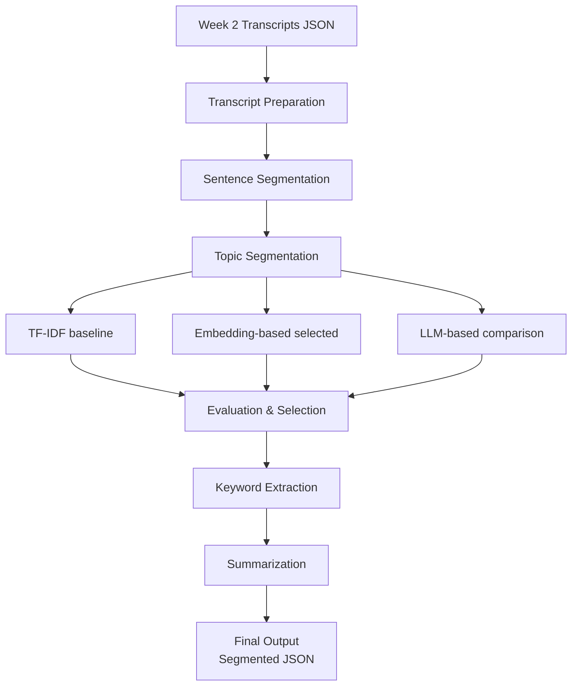

# 🧩 Week 3: Topic Segmentation, Keyword Extraction, and Summarization

> *Transforming transcripts into structured topic segments with AI-powered analysis*

## 🎯 Objective

The objective of **Week 3** is to transform the transcripts generated in Week 2 into a structured, topic-wise representation. From this week onward, the project operates only on text data (transcripts), without using audio files.

The key goals are:

- 🧩 **Segmenting transcripts** into meaningful topic blocks
- 🏷️ **Extracting representative keywords** for each topic
- 📝 **Generating short summaries** for each topic segment

---

## 📋 Prerequisites

- ✅ Completion of Week 2 transcript generation
- 🐍 Python environment with required dependencies (see requirements.txt)
- 📁 Access to processed transcripts in `data/transcripts_processed/`

---

## 🔧 Dependencies

- `nltk` for sentence tokenization
- `sentence-transformers` for semantic embeddings
- `scikit-learn` for TF-IDF and similarity
- `transformers` for BART summarization
- OpenRouter API for LLM segmentation (optional)

---

## 🧩 Key Components

- **📄 Sentence Segmentation**: Divide transcripts into sentences using `nltk.sent_tokenize`
- **🎯 Topic Segmentation Algorithms**:
  - Baseline: TF-IDF + Cosine Similarity
  - Primary: Embedding-based using Sentence-Transformers
  - Comparison: LLM-based via OpenRouter API
- **🏷️ Keyword Extraction**: TF-IDF per segment with stopword removal
- **📝 Summarization**: BART-large-cnn model generating 1-2 sentence summaries

---

## 📥 Input and Output

**Input**
- Automatically generated transcripts from Week 2
- Stored as JSON files in: `data/transcripts_processed/`
- No manual correction or rewriting of transcripts is performed

**Output**
- Topic-segmented transcripts
- Keywords for each topic segment
- Short summaries (1–2 sentences per segment)
- Outputs are saved as JSON files in: `data/segmented_outputs/`

---

## 🔄 Methodology – Week 3 Workflow



---

# 📋 Step-by-Step Implementation: Topic Segmentation, Keyword Extraction, and Summarization

This document describes the detailed implementation steps followed in Week 3 of the project. The pipeline operates entirely on text transcripts generated in Week 2 and converts them into structured, topic-wise segments enriched with keywords and summaries.

---

## 1️⃣ Step 1: Transcript Preparation

The final transcript text generated using Whisper in Week 2 is used as the input.

- Only the textual content is extracted from the transcript JSON files.
- Metadata such as timestamps is retained where available.
- No manual correction, cleaning, or rewriting of transcripts is performed.
- Transcripts are processed exactly as produced to ensure reproducibility and consistency across experiments.

---

## 2️⃣ Step 2: Sentence Segmentation

Each transcript is divided into sentence-level units.

- Sentence splitting is performed using `nltk.sent_tokenize`.
- Each sentence acts as a basic atomic unit for downstream topic segmentation.
- Sentence indices are preserved to enable mapping back to timestamps and original transcript positions.

---

## 3️⃣ Step 3: Topic Segmentation – Algorithm 1 (Baseline)

### TF-IDF Similarity-Based Segmentation

This method serves as the mandatory baseline approach.

- TF-IDF vectors are computed for each sentence.
- Cosine similarity is calculated between consecutive sentence vectors.
- Topic boundaries are detected when similarity drops below a predefined threshold.
- The approach relies on surface-level lexical similarity and does not capture deep semantic changes.

---

## 4️⃣ Step 4: Topic Segmentation – Algorithm 2

### Embedding-Based Semantic Segmentation

This is the primary segmentation method used in the final pipeline.

- Sentence embeddings are generated using the `all-MiniLM-L6-v2` sentence transformer model.
- Semantic similarity is computed between adjacent sentence windows.
- Topic boundaries are identified at significant drops in semantic similarity.
- This approach captures contextual and semantic topic shifts more effectively than lexical methods.

---

## 4️⃣ (Extended) Step 4: Topic Segmentation – Algorithm 3

### LLM-Based Segmentation (Sample-Based)

This approach is implemented for qualitative comparison only.

- A large language model accessed via the OpenRouter API is used
  (e.g., Llama 3.1 8B, Qwen 2.5, or similar free variants).
- Zero-shot prompting is used to identify topic transition points in transcript excerpts.
- Due to API cost, latency, and scalability constraints, this method is not used in the final pipeline.

---

## 5️⃣ Step 5: Comparison and Qualitative Evaluation

The three segmentation approaches are evaluated qualitatively:

- **TF-IDF baseline**
  Tends to over-segment due to sensitivity to vocabulary changes.

- **Embedding-based segmentation**
  Produces coherent, semantically consistent topic blocks with minimal noise.

- **LLM-based segmentation**
  Generates the most human-like topic boundaries but is not scalable.

### Final Choice

The **embedding-based segmentation approach** is selected for further processing due to its strong balance between segmentation quality, computational efficiency, and reproducibility.

---

## 6️⃣ Step 6: Finalization of Topic Segments

- The output from the embedding-based segmentation method is finalized.
- Each segment is treated as representing a single primary topic.
- Segment boundaries are stored using sentence indices and timestamps.

---

## 7️⃣ Step 7: Keyword Extraction

Keywords are extracted independently for each topic segment.

- TF-IDF is applied at the segment level.
- Stopwords are removed.
- The top-ranking keywords are selected to represent the core topic of each segment.

---

## 8️⃣ Step 8: Initial Summarization

Each topic segment is summarized using an abstractive summarization model.

- Summaries are generated using `BART-large-cnn`.
- Each summary is limited to 1–2 sentences.
- The focus is on clarity and interpretability rather than maximum abstraction.

---

## 📤 Output Format

The final output is stored as structured JSON files.

### Example Output

```json
{
  "episode_id": "episode_1",
  "source_file": "episode_1_whisper.json",
  "total_sentences": 342,
  "segments": [
    {
      "segment_id": 1,
      "start_sentence_idx": 0,
      "end_sentence_idx": 38,
      "num_sentences": 38,
      "start_time_sec": 0.0,
      "end_time_sec": 145.2,
      "text_preview": "Host intro ... first story ...",
      "keywords": ["chicago", "family", "story", "childhood"],
      "summary": "The host introduces a personal childhood story set in Chicago."
    }
  ]
}
```

### TF-IDF Similarity-Based Segmentation

This method serves as the mandatory baseline approach.

- TF-IDF vectors are computed for each sentence.
- Cosine similarity is calculated between consecutive sentence vectors.
- Topic boundaries are detected when similarity drops below a predefined threshold.
- The approach relies on surface-level lexical similarity and does not capture deep semantic changes.

---

## Step 4: Topic Segmentation – Algorithm 2

### Embedding-Based Semantic Segmentation

This is the primary segmentation method used in the final pipeline.

- Sentence embeddings are generated using the `all-MiniLM-L6-v2` sentence transformer model.
- Semantic similarity is computed between adjacent sentence windows.
- Topic boundaries are identified at significant drops in semantic similarity.
- This approach captures contextual and semantic topic shifts more effectively than lexical methods.

---

## Step 4 (Extended): Topic Segmentation – Algorithm 3

### LLM-Based Segmentation (Sample-Based)

This approach is implemented for qualitative comparison only.

- A large language model accessed via the OpenRouter API is used  
  (e.g., Llama 3.1 8B, Qwen 2.5, or similar free variants).
- Zero-shot prompting is used to identify topic transition points in transcript excerpts.
- Due to API cost, latency, and scalability constraints, this method is not used in the final pipeline.

---

## Step 5: Comparison and Qualitative Evaluation

The three segmentation approaches are evaluated qualitatively:

- **TF-IDF baseline**  
  Tends to over-segment due to sensitivity to vocabulary changes.

- **Embedding-based segmentation**  
  Produces coherent, semantically consistent topic blocks with minimal noise.

- **LLM-based segmentation**  
  Generates the most human-like topic boundaries but is not scalable.

### Final Choice

The **embedding-based segmentation approach** is selected for further processing due to its strong balance between segmentation quality, computational efficiency, and reproducibility.

---

## Step 6: Finalization of Topic Segments

- The output from the embedding-based segmentation method is finalized.
- Each segment is treated as representing a single primary topic.
- Segment boundaries are stored using sentence indices and timestamps.

---

## Step 7: Keyword Extraction

Keywords are extracted independently for each topic segment.

- TF-IDF is applied at the segment level.
- Stopwords are removed.
- The top-ranking keywords are selected to represent the core topic of each segment.

---

## Step 8: Initial Summarization

Each topic segment is summarized using an abstractive summarization model.

- Summaries are generated using `BART-large-cnn`.
- Each summary is limited to 1–2 sentences.
- The focus is on clarity and interpretability rather than maximum abstraction.

---

## Output Format

The final output is stored as structured JSON files.

### Example Output

```json
{
  "episode_id": "episode_1",
  "source_file": "episode_1_whisper.json",
  "total_sentences": 342,
  "segments": [
    {
      "segment_id": 1,
      "start_sentence_idx": 0,
      "end_sentence_idx": 38,
      "num_sentences": 38,
      "start_time_sec": 0.0,
      "end_time_sec": 145.2,
      "text_preview": "Host intro ... first story ...",
      "keywords": ["chicago", "family", "story", "childhood"],
      "summary": "The host introduces a personal childhood story set in Chicago."
    }
  ]
}

