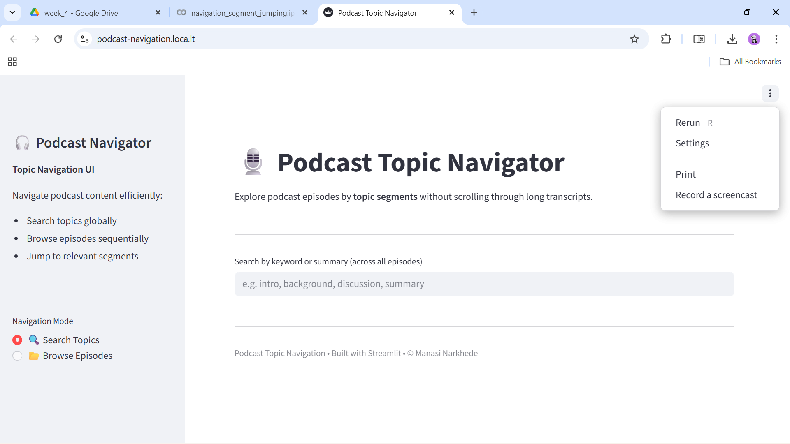
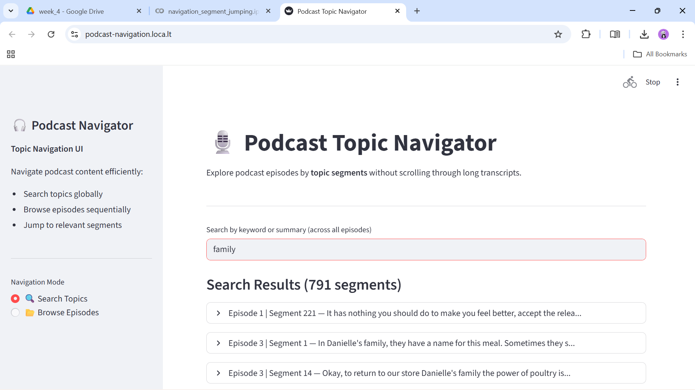
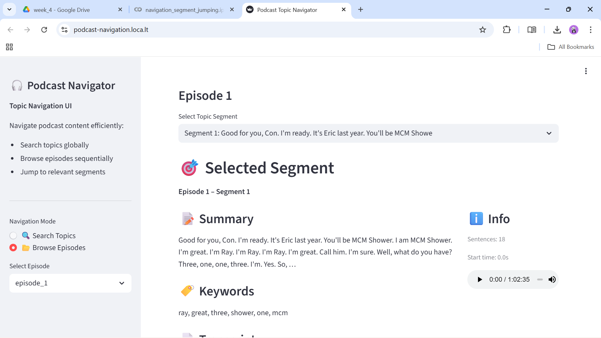
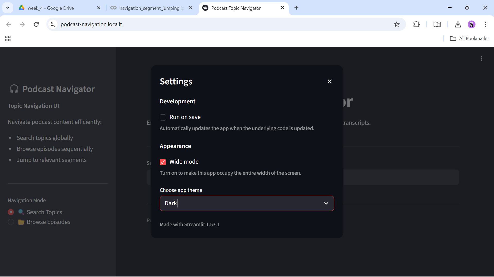

# 🎧 Week 4: Podcast Navigation App

> *Navigate podcast content effortlessly with AI-powered topic segmentation*

## 📋 Overview

In **Week 4**, we developed an interactive **Streamlit web application** that transforms segmented podcast transcripts into an intuitive navigation experience. The app leverages the topic segmentation work from previous weeks to allow users to search and browse podcast content by meaningful topics rather than scrolling through long transcripts.

## ✨ Key Features

| Feature | Description |
|---------|-------------|
| 🔍 **Search Mode** | Global search across all episodes by keywords or topic summaries |
| 📂 **Browse Mode** | Episode-by-episode navigation with segment selection |
| 📝 **Segment Details** | Rich display of summaries, keywords, and highlighted transcripts |
| 🎵 **Audio Playback** | Integrated audio player for seamless listening experience |
| 📊 **Progress Tracking** | Visual indicators showing segment position within episodes |

## 🖼️ Screenshots

### Main Interface

*The welcoming interface with navigation options*

### Search Topics

*Powerful search functionality across all podcast segments*

### Browse Episodes

*Episode selection and segment browsing interface*

### App Theme

*Clean, modern design optimized for podcast exploration*

## 🚀 Quick Start

### Prerequisites
- Python 3.8+
- Streamlit
- Pandas

### Installation
```bash
pip install streamlit pandas
```

### Running the App
```bash
streamlit run ../../../data/app/podcast_navigation_app.py
```

### Data Setup
- Place segmented JSON files in `../../../data/segmented_outputs/`
- Add audio files to `../../../data/audio_raw/` (optional)

## 🏗️ Architecture Highlights

- **Data Processing**: Efficient loading of segmented transcript data
- **UI Framework**: Streamlit for responsive web interface
- **Search Engine**: Real-time filtering and keyword matching
- **Audio Integration**: Direct playback from processed audio files

## 🎯 What We Accomplished

✅ Built a fully functional podcast navigation application  
✅ Implemented dual navigation modes (search & browse)  
✅ Integrated audio playback capabilities  
✅ Created an attractive, user-friendly interface  
✅ Documented the development process with screenshots and demo


