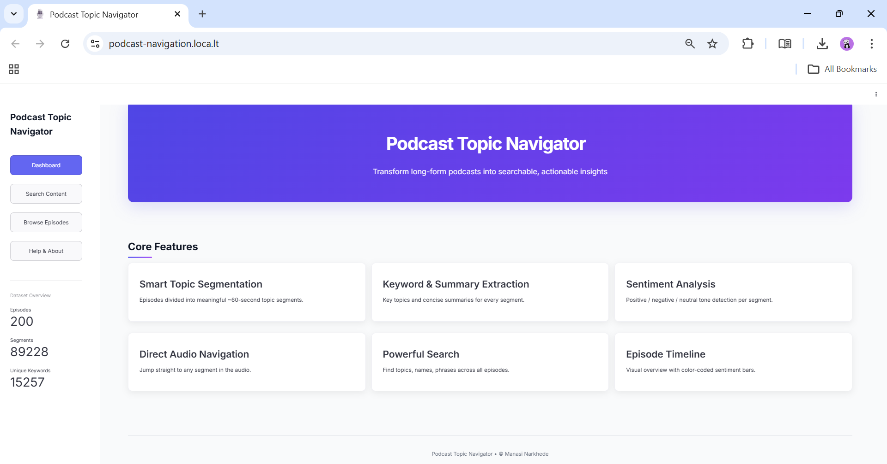
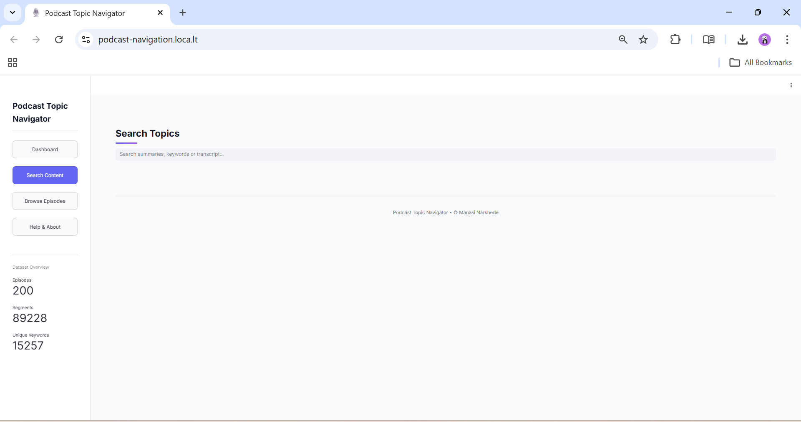
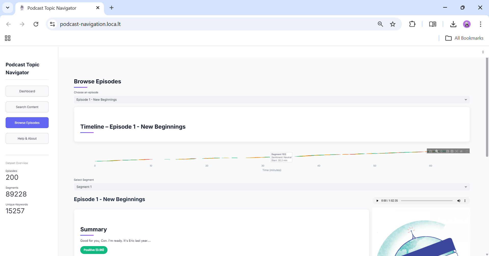
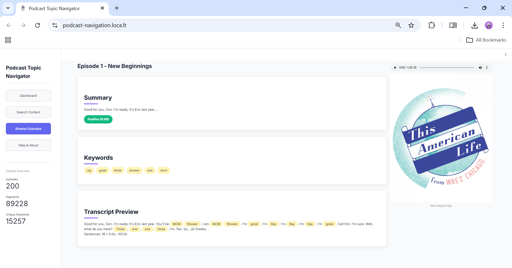
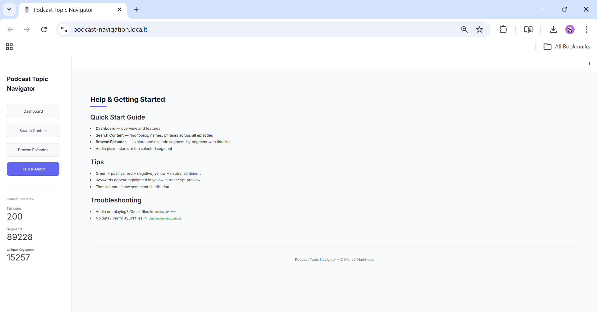

# 🎙️ Week 5: Visualization & Podcast Navigation App

> *Building an interactive web application for exploring podcast segments with beautiful visualizations and intelligent search capabilities*

---

## 📋 Overview

**Week 5** focuses on creating an intuitive, feature-rich **Podcast Topic Navigator** web application that brings all previous pipeline work to life. Using **Streamlit**, we've built a modern interface for browsing episodes, searching topics, analyzing sentiment, and discovering key insights from our processed podcast segments.

### 🎯 Main Deliverables

✅ **Interactive Web Application** - Streamlit-based podcast navigation interface  
✅ **Episode Dashboard** - Home page with key statistics and trending topics  
✅ **Episode Browser** - Browse all episodes with segment previews  
✅ **Topic Search Engine** - Full-text search across all segments and keywords  
✅ **Sentiment Analysis** - Visual sentiment indicators for each segment  
✅ **Keyword Extraction & Visualization** - Word clouds and key topic extraction  
✅ **Beautiful UI/UX** - Modern, responsive design with smooth interactions  

---

## 🚀 Key Features

### 🏠 **Home Dashboard**
Explore podcast statistics at a glance with:
- 📊 Total episodes processed
- 🏷️ Trending topics and keywords
- 💬 Sentiment distribution across all segments
- ⏱️ Average segment length and episode statistics



---

### 🔍 **Search & Discover**
Powerful full-text search engine to find topics, keywords, and discussions:
- Search by keyword across all segments
- Filter by sentiment (Positive, Negative, Neutral)
- Real-time results with preview snippets
- Highlighted keywords in results for easy identification



---

### 📚 **Episode Browser**
Navigate through all processed episodes with detailed segment information:
- View episode titles and descriptions
- Browse segment timings and summaries
- See extracted keywords for each segment
- Sentiment badges for quick assessment





---

### 💡 **Help & Documentation**
Comprehensive guide for using the application:
- Feature explanations and tips
- Navigation help
- Troubleshooting section



---

## 🛠️ Technology Stack

| Component | Technology | Purpose |
|-----------|-----------|---------|
| **Frontend Framework** | Streamlit | Web UI and interactivity |
| **Visualization** | Plotly | Interactive timeline and charts |
| **Text Processing** | WordCloud | Keyword visualization |
| **Sentiment Analysis** | VADER Sentiment | Real-time sentiment scoring |
| **Data Processing** | Pandas | Data manipulation and filtering |
| **Styling** | Custom CSS | Modern, responsive design |

---

## 📱 Application Architecture

```
┌─────────────────────────────────────────────────────────────┐
│                   🎙️ Podcast Navigator                     │
├─────────────────────────────────────────────────────────────┤
│                                                             │
│  ┌────────────────────────────────────────────────────────┐ │
│  │  SIDEBAR NAVIGATION                                   │ │
│  │  • 🏠 Dashboard     • 🔍 Search                       │ │
│  │  • 📚 Browse        • ❓ Help                         │ │
│  └────────────────────────────────────────────────────────┘ │
│                                                             │
│  ┌────────────────────────────────────────────────────────┐ │
│  │  PAGE CONTENT (Dynamic)                               │ │
│  │  ┌──────────────────────────────────────────────────┐ │ │
│  │  │ • Episode Statistics & Trends                   │ │ │
│  │  │ • Segment Search & Filtering                    │ │ │
│  │  │ • Sentiment Analysis Visualizations             │ │ │
│  │  │ • Keyword Extraction & Word Clouds              │ │ │
│  │  │ • Interactive Timeline & Summaries              │ │ │
│  │  └──────────────────────────────────────────────────┘ │ │
│  └────────────────────────────────────────────────────────┘ │
│                                                             │
└─────────────────────────────────────────────────────────────┘
```

---

## 🎨 Features Highlight

### 🎯 **Smart Segment Loading**
- Cache-based data loading for lightning-fast performance
- JSON parsing from segmented outputs
- Automatic sentiment classification

### 💬 **Sentiment Analytics**
- VADER-based compound sentiment scoring
- Visual sentiment badges (Positive/Negative/Neutral)
- Sentiment distribution charts

### 🏷️ **Keyword Intelligence**
- TF-IDF extracted keywords per segment
- Searchable keyword database
- Visual keyword highlighting in segment text

### ⏱️ **Timeline Visualization**
- Interactive Plotly timeline charts
- Segment duration indicators
- Topic progression visualization

### 🎯 **Responsive UI**
- Mobile-friendly layout
- Smooth animations and transitions
- Professional color scheme (Indigo/Purple gradient)

---

## 📊 How to Use

### **Starting the Application**

```bash
# Navigate to the project root
cd d:\Audio Project

# Activate Python environment (if using venv)
.\audio_project_env\Scripts\activate

# Install Streamlit (if not already installed)
pip install streamlit

# Run the application
streamlit run data/app/podcast_navigation_app.py
```

The app will open at `http://localhost:8501` in your default browser.

---

### **Navigation Guide**

| Page | Purpose | Use Case |
|------|---------|----------|
| **🏠 Dashboard** | Overview & statistics | Get high-level insights about the podcast dataset |
| **🔍 Search Content** | Find specific topics | Search for keywords or discussions of interest |
| **📚 Browse Episodes** | Explore episodes | View all episodes with segment details |
| **❓ Help & About** | Documentation | Learn how to use the application |

---

## 📈 Data Processing Pipeline (Week 5 Context)

```
┌──────────────────────┐
│  Segmented Outputs   │  ← From Week 4
│  (JSON files)        │
└──────────┬───────────┘
           │
           ▼
┌──────────────────────┐
│  Data Loading        │
│  (load_data())       │
└──────────┬───────────┘
           │
           ▼
┌──────────────────────┐
│  Sentiment Analysis  │  ← VADER SentimentAnalyzer
│  & Classification    │
└──────────┬───────────┘
           │
           ▼
┌──────────────────────┐
│  Pandas DataFrame    │  ← Optimized for UI
│  (Cached in Streamlit) │
└──────────┬───────────┘
           │
           ▼
┌──────────────────────┐
│  UI Rendering        │
│  (Streamlit Pages)   │
└──────────────────────┘
```

---

## 🔧 Configuration & Customization

### **Paths Configuration**
Update these paths in the app if your directory structure differs:

```python
BASE_PATH = "/content/drive/MyDrive/podcast-project"
SEGMENT_DIR = os.path.join(BASE_PATH, "data/segmented_outputs")
AUDIO_DIR = os.path.join(BASE_PATH, "data/audio_raw")
```

### **Sentiment Thresholds**
Adjust sentiment classification boundaries:

```python
sentiment = (
    "Positive" if score >= 0.05 else
    "Negative" if score <= -0.05 else
    "Neutral"
)
```

### **Styling Customization**
Custom CSS is embedded in the app for easy theme modifications:
- Update gradient colors in `.hero` class
- Modify badge colors in `SENTIMENT_COLOR` dictionary
- Adjust spacing and typography in CSS section

---

## 📦 Dependencies

```
streamlit>=1.28.0
pandas>=1.5.0
plotly>=5.13.0
wordcloud>=1.9.2
vaderSentiment>=3.3.2
```

Install all dependencies:
```bash
pip install -r requirements.txt
```

---

## ✨ Key Insights from Week 5

### 💡 **Technical Achievements**
- Built responsive web UI with Streamlit
- Implemented sentiment analysis pipeline
- Created efficient data caching system
- Designed professional UI with custom CSS
- Integrated multiple NLP visualizations

### 🚀 **Performance Optimization**
- `@st.cache_data` decorator for fast data loading
- Efficient JSON parsing and filtering
- Vectorized sentiment scoring with VADER
- Memory-efficient DataFrame operations

---


## 🐛 Troubleshooting

### **App won't start**
- Ensure all dependencies are installed: `pip install -r requirements.txt`
- Check that the segment directory path is correct
- Verify JSON files exist in `data/segmented_outputs/`

### **No data loading**
- Confirm segment JSON files are properly formatted
- Check file permissions and path configurations
- Review console output for specific error messages

### **Slow performance**
- First load may be slower due to data caching
- Refresh page to use cached data (faster loads)
- Consider filtering to fewer episodes for testing

---

## 📚 Resources

- [Streamlit Documentation](https://docs.streamlit.io)
- [VADER Sentiment Analysis](https://github.com/cjhutto/vaderSentiment)
- [Plotly Visualization](https://plotly.com/python/)
- [WordCloud Library](https://github.com/amueller/word_cloud)

---

## ✍️ Author Notes

This week represents a major milestone—the convergence of all technical work into a polished, user-facing application. The podcast navigator demonstrates how raw audio files transform into an intelligent, searchable knowledge base through our pipeline.

**Key Achievement**: From raw podcast files to interactive web app in 5 weeks! 🎉

---

<div align="center">

### 🎧 **Happy Podcasting!**

*Navigate. Search. Discover. Learn.*


</div>
