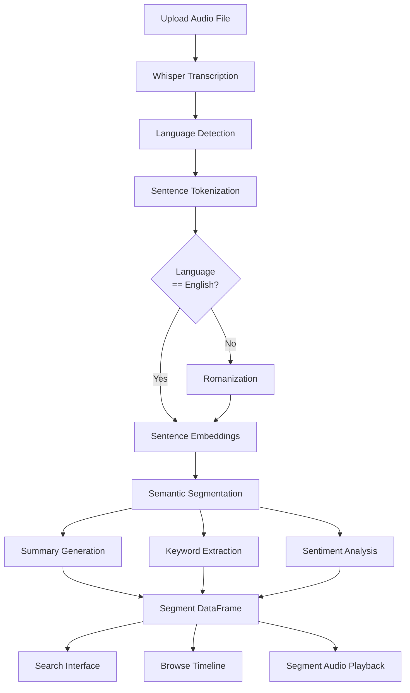
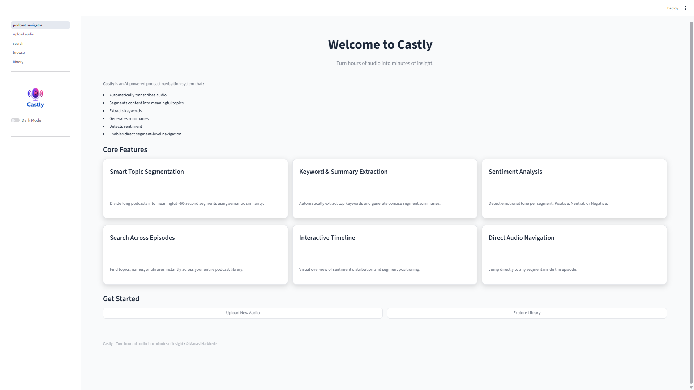
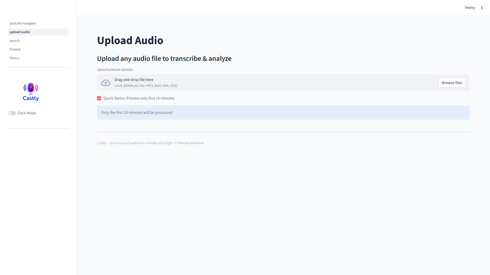
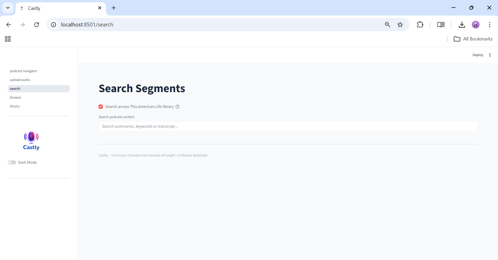
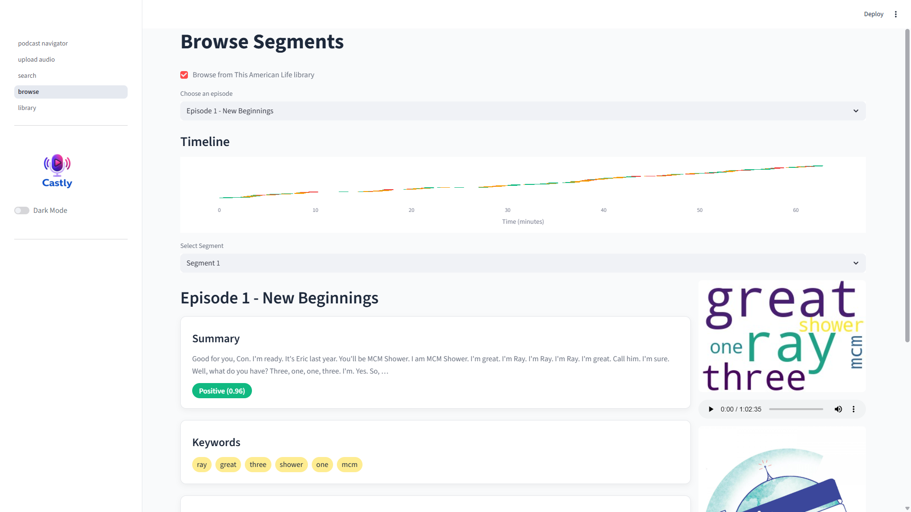
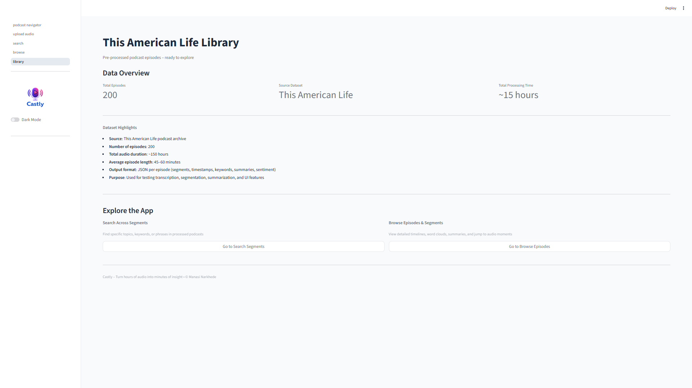
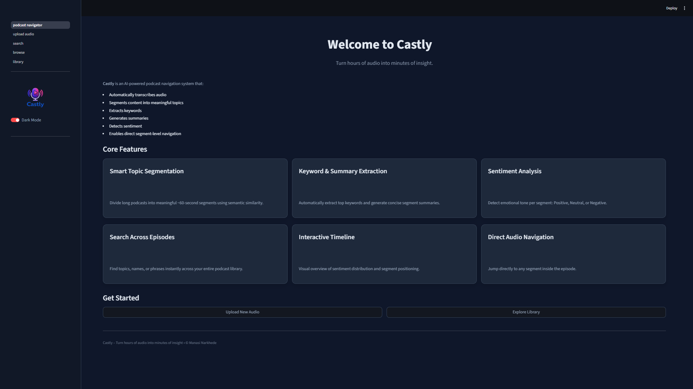
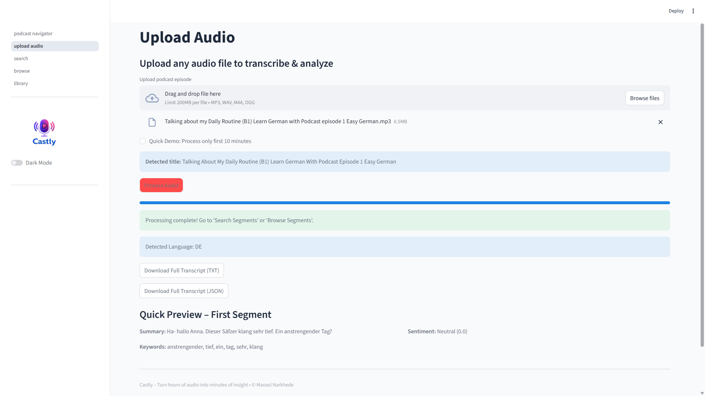

# Week 7: Castly - AI-Powered Podcast Topic Navigator

------------------------------------------------------------------------

## 🚀 Project Overview

**Castly** is an AI-powered podcast analysis system that transforms
long-form audio into structured, searchable, and insight-rich segments.

## 🎯Features of Castly

-   🌍 Automatic language detection\
-   🔤 Romanization for non-English audio\
-   🧠 Improved semantic segmentation\
-   🏷️ Enhanced keyword extraction\
-   🎧 Segment-level audio playback\
-   🌗 Refined Dark Mode UI

------------------------------------------------------------------------

## 🧠 System Architecture



------------------------------------------------------------------------
## 🖥️ Application Screenshots

### Podcast Topic Navigator


### Upload & Processing


### Search Segments


### Browse & Timeline View

(screenshots/browse_segments2.png)

### Library(This American Life Podcasts)


### Dark Mode


### Multilingual + Romanization 


---------------
## 🧩 Core Features

### 1️⃣ Automatic Language Detection

-   Uses Whisper metadata (`info.language`)
-   No manual language selection required
-   Stored in session state and attached to segments

### 2️⃣ Romanization Support

-   Non-English transcripts are transliterated using `unidecode`
-   Each segment stores:
    -   Original transcript
    -   Romanized transcript
    -   Language code
-   Romanized text displayed automatically in Search & Browse

### 3️⃣ Semantic Segmentation

-   Sentence embeddings (`all-MiniLM-L6-v2`)
-   Cosine similarity-based topic grouping
-   Produces coherent topic-based segments

### 4️⃣ Keyword Extraction

-   Stopword removal
-   Token filtering
-   Frequency ranking
-   Clean top 5--6 keywords per segment

### 5️⃣ Sentiment Analysis

-   VADER sentiment scoring
-   Labels: Positive, Neutral, Negative
-   Color-coded badges in UI

### 6️⃣ Interactive UI

-   Search across segments
-   Timeline-based browsing
-   WordCloud visualization
-   Segment-level audio playback
-   Dark mode support

------------------------------------------------------------------------

## 🏗️ Tech Stack

### Speech & NLP

-   faster-whisper
-   sentence-transformers
-   nltk
-   vaderSentiment
-   unidecode

### Audio Processing

-   PyDub
-   Mutagen

### Visualization

-   Plotly
-   WordCloud
-   Matplotlib

### Framework

-   Streamlit

------------------------------------------------------------------------

## 📂 Project Structure

    app/
    │
    ├── podcast_navigator.py
    ├── utils.py
    │
    ├── pages/
    │   ├── 01_upload_audio.py
    │   ├── 02_search.py
    │   ├── 03_browse.py
    │   └── 04_library.py

------------------------------------------------------------------------

## 🌍 Multilingual Capability

Supported automatically via Whisper:

-   English
-   German
-   Hindi
-   Spanish
-   Tamil
-   Arabic
-   Russian
-   Japanese
-   And more

Romanization activates when detected language ≠ English.

------------------------------------------------------------------------

## 🎯 Week 7 Achievements

  Feature                        Status
  ------------------------------ --------
  Automatic language detection   ✅
  Romanization                   ✅
  Semantic segmentation          ✅
  Segment-level playback         ✅
  Search functionality           ✅
  Timeline visualization         ✅
  Dark mode                      ✅

------------------------------------------------------------------------

## 🚀 How to Run

``` bash
pip install -r requirements.txt
streamlit run podcast_navigator.py
```

------------------------------------------------------------------------

## 🎙️ Castly

> Turn hours of audio into minutes of insight.
